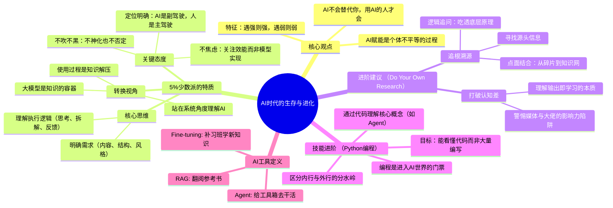

## 图谱（Obsidian 预览中打开）

```mermaid
mindmap
root((AI时代的生存与进化))
  核心观点
    AI不会替代你，用AI的人才会
    AI赋能是个体不平等的过程
    特征：遇强则强，遇弱则弱
  5%少数派的特质
    核心思维
      明确需求（内容、结构、风格）
      理解执行逻辑（思考、拆解、反馈）
    关键态度
      不吹不黑：不神化也不否定
      定位明确：AI是副驾驶，人是主驾驶
      不焦虑：关注效能而非模型实现
    转换视角
      大模型是知识的容器
      使用过程是知识解压
      站在系统角度理解AI
  进阶建议 （Do Your Own Research）
    打破认知差
      警惕媒体与大佬的影响力陷阱
      理解输出即学习的本质
    追根溯源
      寻找源头信息
      逻辑追问：吃透底层原理
      点面结合：从碎片到知识网
  技能进阶 （Python编程）
    编程是进入AI世界的门票
    目标：能看懂代码而非大量编写
    通过代码理解核心概念（如Agent）
    区分内行与外行的分水岭
  AI工具定义
    Fine-tuning: 补习班学新知识
    RAG: 翻阅参考书
    Agent: 给工具箱去干活
```

## 与 Wiki 的链接

<!-- Stage C 完成后自动补充 wikilinks -->
