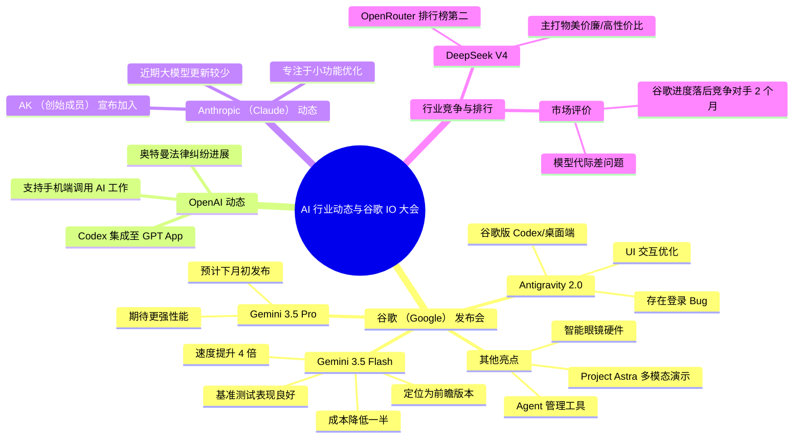

## 图谱（Obsidian 预览中打开）

```mermaid
mindmap
root((AI 行业动态与谷歌 IO 大会))
  谷歌 （Google） 发布会
    Gemini 3.5 Flash
      速度提升 4 倍
      成本降低一半
      基准测试表现良好
      定位为前瞻版本
    Gemini 3.5 Pro
      预计下月初发布
      期待更强性能
    Antigravity 2.0
      谷歌版 Codex/桌面端
      UI 交互优化
      存在登录 Bug
    其他亮点
      Project Astra 多模态演示
      智能眼镜硬件
      Agent 管理工具
  OpenAI 动态
    Codex 集成至 GPT App
    支持手机端调用 AI 工作
    奥特曼法律纠纷进展
  Anthropic （Claude） 动态
    AK （创始成员） 宣布加入
    近期大模型更新较少
    专注于小功能优化
  行业竞争与排行
    DeepSeek V4
      OpenRouter 排行榜第二
      主打物美价廉/高性价比
    市场评价
      谷歌进度落后竞争对手 2 个月
      模型代际差问题
```

## 与 Wiki 的链接

<!-- Stage C 完成后自动补充 wikilinks -->
