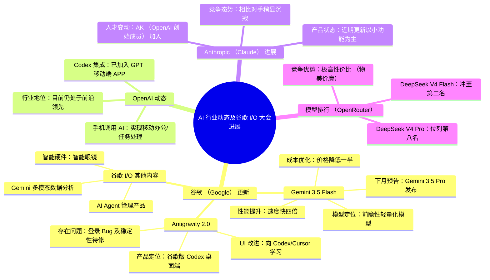

## 图谱（Obsidian 预览中打开）

```mermaid
mindmap
root((AI 行业动态及谷歌 I/O 大会进展))
  谷歌 （Google） 更新
    Gemini 3.5 Flash
      性能提升：速度快四倍
      成本优化：价格降低一半
      模型定位：前瞻性轻量化模型
      下月预告：Gemini 3.5 Pro 发布
    Antigravity 2.0
      产品定位：谷歌版 Codex 桌面端
      UI 改进：向 Codex/Cursor 学习
      存在问题：登录 Bug 及稳定性待修
    谷歌 I/O 其他内容
      Gemini 多模态数据分析
      智能硬件：智能眼镜
      AI Agent 管理产品
  OpenAI 动态
    Codex 集成：已加入 GPT 移动端 APP
    手机调用 AI：实现移动办公/任务处理
    行业地位：目前仍处于前沿领先
  Anthropic （Claude） 进展
    人才变动：AK （OpenAI 创始成员） 加入
    产品状态：近期更新以小功能为主
    竞争态势：相比对手稍显沉寂
  模型排行 （OpenRouter）
    DeepSeek V4 Flash：冲至第二名
    DeepSeek V4 Pro：位列第八名
    竞争优势：极高性价比 （物美价廉）
```

## 与 Wiki 的链接

<!-- Stage C 完成后自动补充 wikilinks -->
