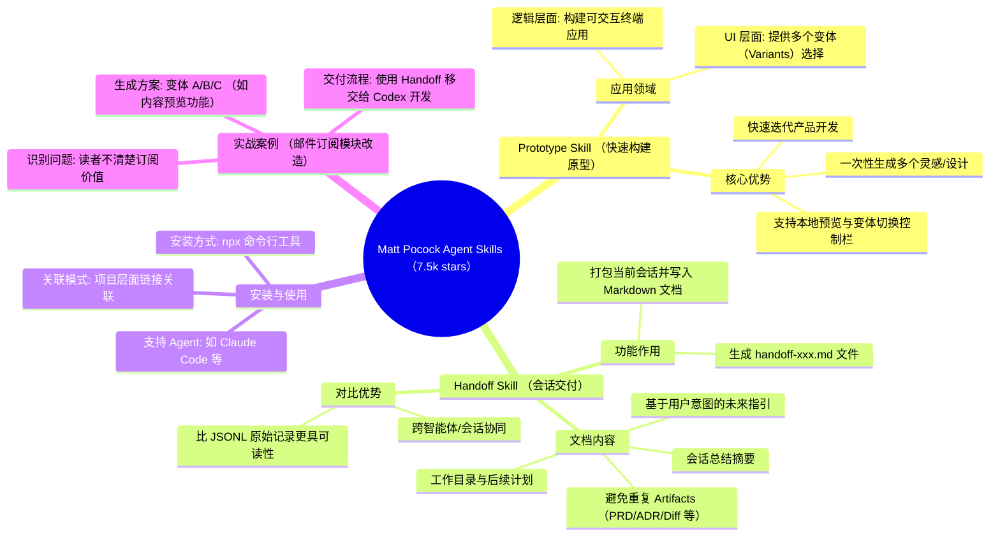

## 图谱（Obsidian 预览中打开）

```mermaid
mindmap
root((Matt Pocock Agent Skills （7.5k stars）))
  Prototype Skill （快速构建原型）
    应用领域
      逻辑层面: 构建可交互终端应用
      UI 层面: 提供多个变体（Variants）选择
    核心优势
      快速迭代产品开发
      一次性生成多个灵感/设计
      支持本地预览与变体切换控制栏
  Handoff Skill （会话交付）
    功能作用
      打包当前会话并写入 Markdown 文档
      生成 handoff-xxx.md 文件
    文档内容
      会话总结摘要
      工作目录与后续计划
      基于用户意图的未来指引
      避免重复 Artifacts （PRD/ADR/Diff 等）
    对比优势
      比 JSONL 原始记录更具可读性
      跨智能体/会话协同
  安装与使用
    安装方式: npx 命令行工具
    支持 Agent: 如 Claude Code 等
    关联模式: 项目层面链接关联
  实战案例 （邮件订阅模块改造）
    识别问题: 读者不清楚订阅价值
    生成方案: 变体 A/B/C （如内容预览功能）
    交付流程: 使用 Handoff 移交给 Codex 开发
```

## 与 Wiki 的链接

<!-- Stage C 完成后自动补充 wikilinks -->
