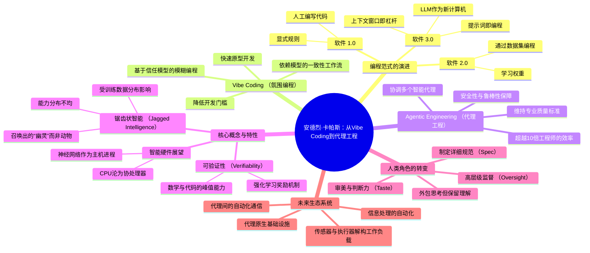

## 图谱（Obsidian 预览中打开）

```mermaid
mindmap
root((安德烈·卡帕斯：从Vibe Coding到代理工程))
  编程范式的演进
    软件 1.0
      显式规则
      人工编写代码
    软件 2.0
      学习权重
      通过数据集编程
    软件 3.0
      LLM作为新计算机
      提示词即编程
      上下文窗口即杠杆
  Vibe Coding （氛围编程）
    降低开发门槛
    基于信任模型的模糊编程
    快速原型开发
    依赖模型的一致性工作流
  Agentic Engineering （代理工程）
    维持专业质量标准
    协调多个智能代理
    超越10倍工程师的效率
    安全性与鲁棒性保障
  核心概念与特性
    可验证性 （Verifiability）
      强化学习奖励机制
      数学与代码的峰值能力
    锯齿状智能 （Jagged Intelligence）
      能力分布不均
      受训练数据分布影响
      召唤出的“幽灵”而非动物
    智能硬件展望
      神经网络作为主机进程
      CPU沦为协处理器
  人类角色的转变
    审美与判断力 （Taste）
    制定详细规范 （Spec）
    高层级监督 （Oversight）
    外包思考但保留理解
  未来生态系统
    代理原生基础设施
    传感器与执行器解构工作负载
    代理间的自动化通信
    信息处理的自动化
```

## 与 Wiki 的链接

<!-- Stage C 完成后自动补充 wikilinks -->
