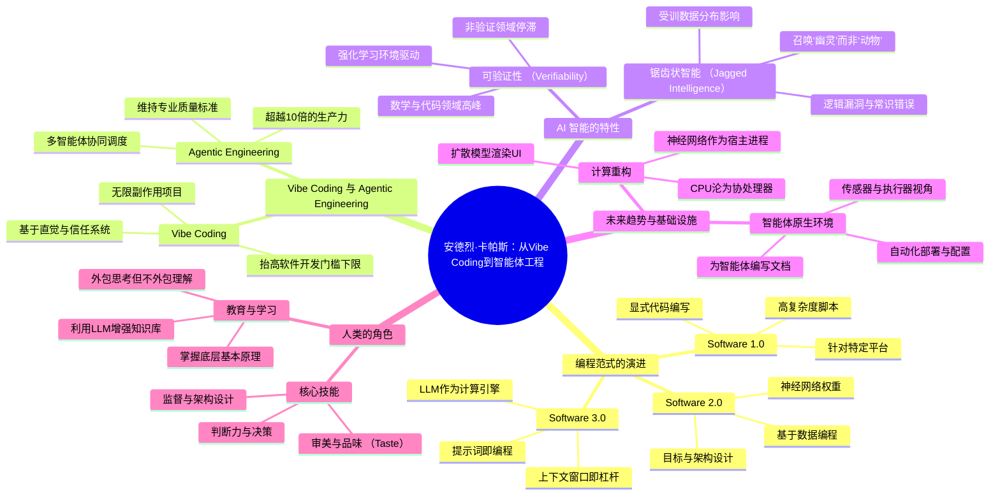

## 图谱（Obsidian 预览中打开）

```mermaid
mindmap
root((安德烈·卡帕斯：从Vibe Coding到智能体工程))
  编程范式的演进
    Software 1.0
      显式代码编写
      针对特定平台
      高复杂度脚本
    Software 2.0
      神经网络权重
      基于数据编程
      目标与架构设计
    Software 3.0
      LLM作为计算引擎
      提示词即编程
      上下文窗口即杠杆
  Vibe Coding 与 Agentic Engineering
    Vibe Coding
      抬高软件开发门槛下限
      基于直觉与信任系统
      无限副作用项目
    Agentic Engineering
      维持专业质量标准
      多智能体协同调度
      超越10倍的生产力
  AI 智能的特性
    可验证性 （Verifiability）
      强化学习环境驱动
      数学与代码领域高峰
      非验证领域停滞
    锯齿状智能 （Jagged Intelligence）
      受训数据分布影响
      逻辑漏洞与常识错误
      召唤‘幽灵’而非‘动物’
  未来趋势与基础设施
    智能体原生环境
      为智能体编写文档
      自动化部署与配置
      传感器与执行器视角
    计算重构
      神经网络作为宿主进程
      CPU沦为协处理器
      扩散模型渲染UI
  人类的角色
    核心技能
      审美与品味 （Taste）
      判断力与决策
      监督与架构设计
    教育与学习
      外包思考但不外包理解
      掌握底层基本原理
      利用LLM增强知识库
```

## 与 Wiki 的链接

<!-- Stage C 完成后自动补充 wikilinks -->
