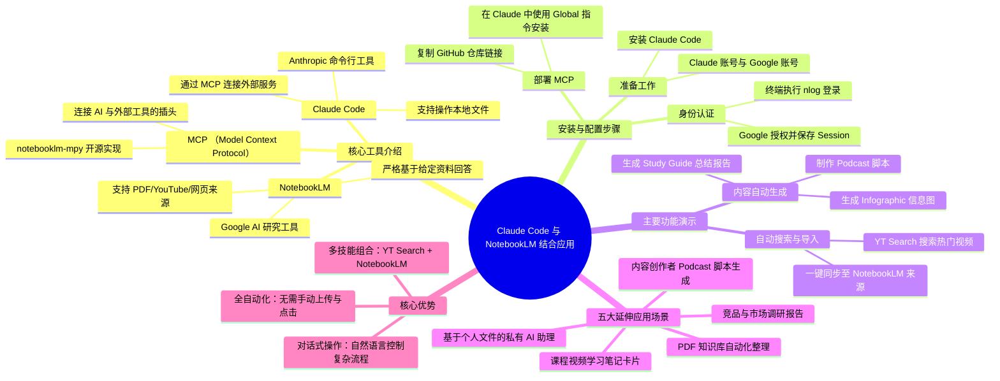

## 图谱（Obsidian 预览中打开）

```mermaid
mindmap
root((Claude Code 与 NotebookLM 结合应用))
  核心工具介绍
    NotebookLM
      Google AI 研究工具
      支持 PDF/YouTube/网页来源
      严格基于给定资料回答
    Claude Code
      Anthropic 命令行工具
      支持操作本地文件
      通过 MCP 连接外部服务
    MCP （Model Context Protocol）
      连接 AI 与外部工具的插头
      notebooklm-mpy 开源实现
  安装与配置步骤
    准备工作
      Claude 账号与 Google 账号
      安装 Claude Code
    部署 MCP
      复制 GitHub 仓库链接
      在 Claude 中使用 Global 指令安装
    身份认证
      终端执行 nlog 登录
      Google 授权并保存 Session
  主要功能演示
    自动搜索与导入
      YT Search 搜索热门视频
      一键同步至 NotebookLM 来源
    内容自动生成
      生成 Infographic 信息图
      生成 Study Guide 总结报告
      制作 Podcast 脚本
  五大延伸应用场景
    PDF 知识库自动化整理
    内容创作者 Podcast 脚本生成
    竞品与市场调研报告
    课程视频学习笔记卡片
    基于个人文件的私有 AI 助理
  核心优势
    全自动化：无需手动上传与点击
    多技能组合：YT Search + NotebookLM
    对话式操作：自然语言控制复杂流程
```

## 与 Wiki 的链接

<!-- Stage C 完成后自动补充 wikilinks -->
