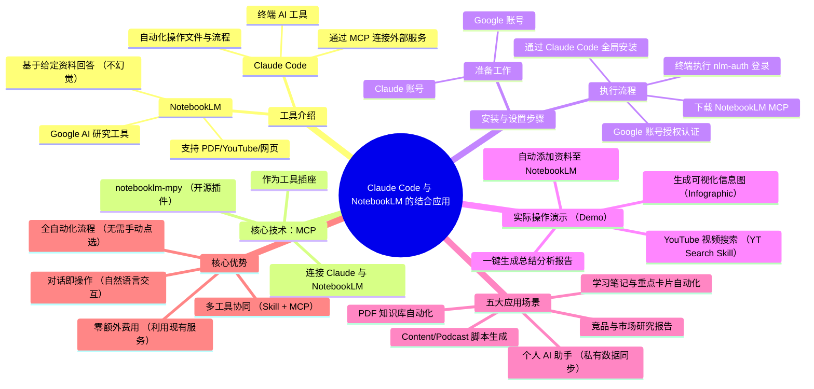

## 图谱（Obsidian 预览中打开）

```mermaid
mindmap
root((Claude Code 与 NotebookLM 的结合应用))
  工具介绍
    NotebookLM
      Google AI 研究工具
      支持 PDF/YouTube/网页
      基于给定资料回答 （不幻觉）
    Claude Code
      终端 AI 工具
      通过 MCP 连接外部服务
      自动化操作文件与流程
  核心技术：MCP
    作为工具插座
    notebooklm-mpy （开源插件）
    连接 Claude 与 NotebookLM
  安装与设置步骤
    准备工作
      Claude 账号
      Google 账号
    执行流程
      下载 NotebookLM MCP
      通过 Claude Code 全局安装
      终端执行 nlm-auth 登录
      Google 账号授权认证
  实际操作演示 （Demo）
    YouTube 视频搜索 （YT Search Skill）
    自动添加资料至 NotebookLM
    生成可视化信息图 （Infographic）
    一键生成总结分析报告
  五大应用场景
    PDF 知识库自动化
    Content/Podcast 脚本生成
    竞品与市场研究报告
    学习笔记与重点卡片自动化
    个人 AI 助手 （私有数据同步）
  核心优势
    全自动化流程 （无需手动点选）
    对话即操作 （自然语言交互）
    多工具协同 （Skill + MCP）
    零额外费用 （利用现有服务）
```

## 与 Wiki 的链接

<!-- Stage C 完成后自动补充 wikilinks -->
