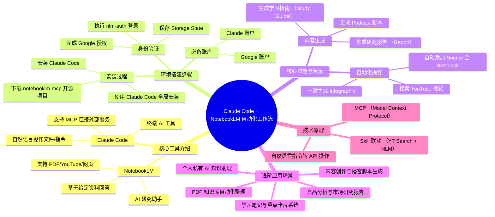

## 图谱（Obsidian 预览中打开）

```mermaid
mindmap
root((Claude Code + NotebookLM 自动化工作流))
  核心工具介绍
    NotebookLM
      AI 研究助手
      支持 PDF/YouTube/网页
      基于给定资料回答
    Claude Code
      终端 AI 工具
      支持 MCP 连接外部服务
      自然语言操作文件/指令
  环境搭建步骤
    必备账户
      Claude 账户
      Google 账户
    安装过程
      安装 Claude Code
      下载 notebooklm-mcp 开源项目
      使用 Claude Code 全局安装
    身份验证
      执行 nlm-auth 登录
      完成 Google 授权
      保存 Storage State
  核心功能与演示
    自动化操作
      搜索 YouTube 视频
      自动添加 Source 至 Notebook
      一键生成 Infographic
    内容生成
      生成研究报告 （Report）
      生成学习指南 （Study Guide）
      生成 Podcast 脚本
  进阶应用场景
    PDF 知识库自动化整理
    内容创作与播客脚本生成
    竞品分析与市场研究报告
    学习笔记与重点卡片系统
    个人私有 AI 知识助理
  技术原理
    MCP （Model Context Protocol）
    Skill 联动 （YT Search + NLM）
    自然语言指令转 API 操作
```

## 与 Wiki 的链接

<!-- Stage C 完成后自动补充 wikilinks -->
