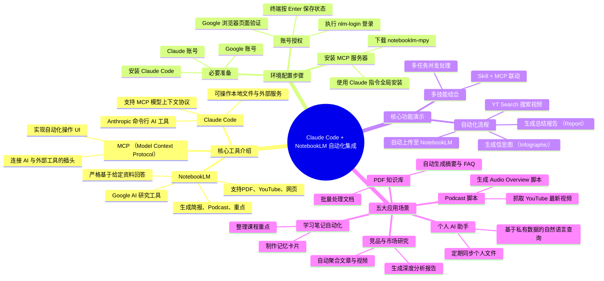

## 图谱（Obsidian 预览中打开）

```mermaid
mindmap
root((Claude Code + NotebookLM 自动化集成))
  核心工具介绍
    NotebookLM
      Google AI 研究工具
      支持PDF、YouTube、网页
      严格基于给定资料回答
      生成简报、Podcast、重点
    Claude Code
      Anthropic 命令行 AI 工具
      支持 MCP 模型上下文协议
      可操作本地文件与外部服务
    MCP （Model Context Protocol）
      连接 AI 与外部工具的插头
      实现自动化操作 UI
  环境配置步骤
    必要准备
      Claude 账号
      Google 账号
      安装 Claude Code
    安装 MCP 服务器
      下载 notebooklm-mpy
      使用 Claude 指令全局安装
    账号授权
      执行 nlm-login 登录
      Google 浏览器页面验证
      终端按 Enter 保存状态
  核心功能演示
    自动化流程
      YT Search 搜索视频
      自动上传至 NotebookLM
      生成信息图 （Infographic）
      生成总结报告 （Report）
    多技能结合
      Skill + MCP 联动
      多任务并发处理
  五大应用场景
    PDF 知识库
      批量处理文档
      自动生成摘要与 FAQ
    Podcast 脚本
      抓取 YouTube 最新视频
      生成 Audio Overview 脚本
    竞品与市场研究
      自动聚合文章与视频
      生成深度分析报告
    学习笔记自动化
      整理课程重点
      制作记忆卡片
    个人 AI 助手
      定期同步个人文件
      基于私有数据的自然语言查询
```

## 与 Wiki 的链接

<!-- Stage C 完成后自动补充 wikilinks -->
