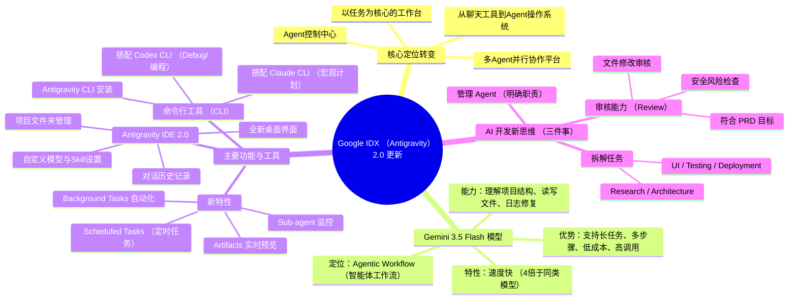

## 图谱（Obsidian 预览中打开）

```mermaid
mindmap
root((Google IDX （Antigravity） 2.0 更新))
  核心定位转变
    从聊天工具到Agent操作系统
    Agent控制中心
    多Agent并行协作平台
    以任务为核心的工作台
  Gemini 3.5 Flash 模型
    定位：Agentic Workflow （智能体工作流）
    特性：速度快 （4倍于同类模型）
    优势：支持长任务、多步骤、低成本、高调用
    能力：理解项目结构、读写文件、日志修复
  主要功能与工具
    Antigravity IDE 2.0
      全新桌面界面
      项目文件夹管理
      对话历史记录
      自定义模型与Skill设置
    新特性
      Scheduled Tasks （定时任务）
      Sub-agent 监控
      Artifacts 实时预览
      Background Tasks 自动化
    命令行工具 （CLI）
      Antigravity CLI 安装
      搭配 Claude CLI （宏观计划）
      搭配 Codex CLI （Debug/编程）
  AI 开发新思维 （三件事）
    拆解任务
      Research / Architecture
      UI / Testing / Deployment
    管理 Agent （明确职责）
    审核能力 （Review）
      文件修改审核
      安全风险检查
      符合 PRD 目标
```

## 与 Wiki 的链接

<!-- Stage C 完成后自动补充 wikilinks -->
