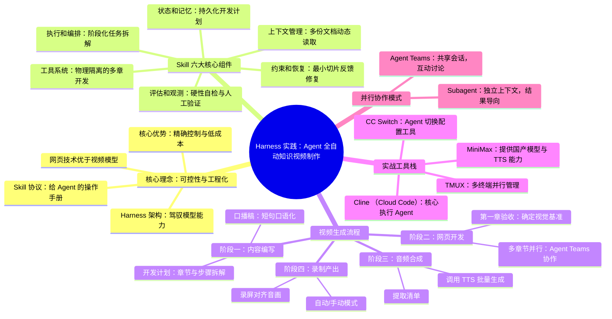

## 图谱（Obsidian 预览中打开）

```mermaid
mindmap
root((Harness 实践：Agent 全自动知识视频制作))
  核心理念：可控性与工程化
    网页技术优于视频模型
    核心优势：精确控制与低成本
    Harness 架构：驾驭模型能力
    Skill 协议：给 Agent 的操作手册
  Skill 六大核心组件
    执行和编排：阶段化任务拆解
    上下文管理：多份文档动态读取
    状态和记忆：持久化开发计划
    工具系统：物理隔离的多章开发
    评估和观测：硬性自检与人工验证
    约束和恢复：最小切片反馈修复
  视频生成流程
    阶段一：内容编写
      口播稿：短句口语化
      开发计划：章节与步骤拆解
    阶段二：网页开发
      第一章验收：确定视觉基准
      多章节并行：Agent Teams 协作
    阶段三：音频合成
      提取清单
      调用 TTS 批量生成
    阶段四：录制产出
      自动/手动模式
      录屏对齐音画
  实战工具栈
    Cline （Cloud Code）：核心执行 Agent
    MiniMax：提供国产模型与 TTS 能力
    CC Switch：Agent 切换配置工具
    TMUX：多终端并行管理
  并行协作模式
    Subagent：独立上下文，结果导向
    Agent Teams：共享会话，互动讨论
```

## 与 Wiki 的链接

<!-- Stage C 完成后自动补充 wikilinks -->
