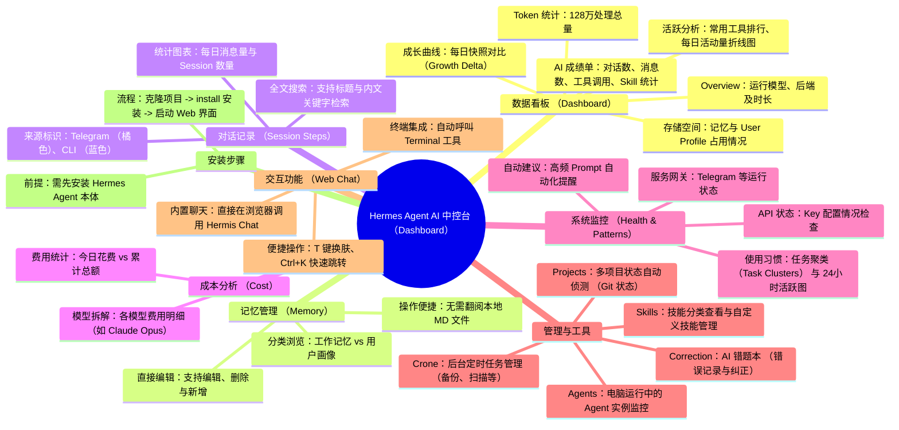

## 图谱（Obsidian 预览中打开）

```mermaid
mindmap
root((Hermes Agent AI 中控台 （Dashboard）))
  数据看板 （Dashboard）
    Overview：运行模型、后端及时长
    AI 成绩单：对话数、消息数、工具调用、Skill 统计
    Token 统计：128万处理总量
    存储空间：记忆与 User Profile 占用情况
    成长曲线：每日快照对比 （Growth Delta）
    活跃分析：常用工具排行、每日活动量折线图
  记忆管理 （Memory）
    分类浏览：工作记忆 vs 用户画像
    直接编辑：支持编辑、删除与新增
    操作便捷：无需翻阅本地 MD 文件
  对话记录 （Session Steps）
    统计图表：每日消息量与 Session 数量
    来源标识：Telegram （橘色）、CLI （蓝色）
    全文搜索：支持标题与内文关键字检索
  成本分析 （Cost）
    费用统计：今日花费 vs 累计总额
    模型拆解：各模型费用明细 （如 Claude Opus）
  系统监控 （Health & Patterns）
    API 状态：Key 配置情况检查
    服务网关：Telegram 等运行状态
    使用习惯：任务聚类 （Task Clusters） 与 24小时活跃图
    自动建议：高频 Prompt 自动化提醒
  管理与工具
    Skills：技能分类查看与自定义技能管理
    Crone：后台定时任务管理 （备份、扫描等）
    Projects：多项目状态自动侦测 （Git 状态）
    Agents：电脑运行中的 Agent 实例监控
    Correction：AI 错题本 （错误记录与纠正）
  交互功能 （Web Chat）
    内置聊天：直接在浏览器调用 Hermis Chat
    终端集成：自动呼叫 Terminal 工具
    便捷操作：T 键换肤、Ctrl+K 快速跳转
  安装步骤
    前提：需先安装 Hermes Agent 本体
    流程：克隆项目 -> install 安装 -> 启动 Web 界面
```

## 与 Wiki 的链接

<!-- Stage C 完成后自动补充 wikilinks -->
