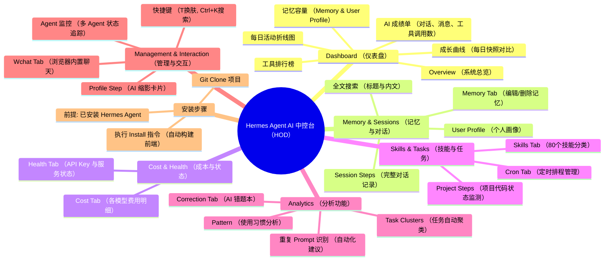

## 图谱（Obsidian 预览中打开）

```mermaid
mindmap
root((Hermes Agent AI 中控台 （HOD）))
  Dashboard （仪表盘）
    Overview （系统总览）
    AI 成绩单 （对话、消息、工具调用数）
    记忆容量 （Memory & User Profile）
    成长曲线 （每日快照对比）
    工具排行榜
    每日活动折线图
  Memory & Sessions （记忆与对话）
    Memory Tab （编辑/删除记忆）
    User Profile （个人画像）
    Session Steps （完整对话记录）
    全文搜索 （标题与内文）
  Cost & Health （成本与状态）
    Cost Tab （各模型费用明细）
    Health Tab （API Key 与服务状态）
  Skills & Tasks （技能与任务）
    Skills Tab （80个技能分类）
    Cron Tab （定时排程管理）
    Project Steps （项目代码状态监测）
  Analytics （分析功能）
    Pattern （使用习惯分析）
    Task Clusters （任务自动聚类）
    重复 Prompt 识别 （自动化建议）
    Correction Tab （AI 错题本）
  Management & Interaction （管理与交互）
    Profile Step （AI 缩影卡片）
    Wchat Tab （浏览器内置聊天）
    Agent 监控 （多 Agent 状态追踪）
    快捷键 （T换肤, Ctrl+K搜索）
  安装步骤
    前提: 已安装 Hermes Agent
    Git Clone 项目
    执行 Install 指令 （自动构建前端）
```

## 与 Wiki 的链接

<!-- Stage C 完成后自动补充 wikilinks -->
