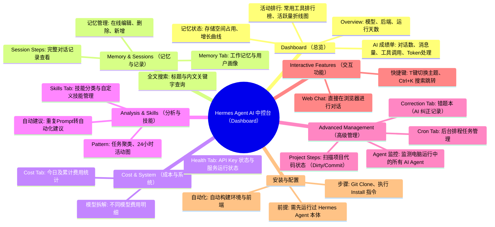

## 图谱（Obsidian 预览中打开）

```mermaid
mindmap
root((Hermes Agent AI 中控台 （Dashboard）))
  Dashboard （总览）
    Overview: 模型、后端、运行天数
    AI 成绩单: 对话数、消息量、工具调用、Token处理
    记忆状态: 存储空间占用、增长曲线
    活动排行: 常用工具排行榜、活跃量折线图
  Memory & Sessions （记忆与记录）
    Memory Tab: 工作记忆与用户画像
    记忆管理: 在线编辑、删除、新增
    Session Steps: 完整对话记录查看
    全文搜索: 标题与内文关键字查询
  Cost & System （成本与系统）
    Cost Tab: 今日及累计费用统计
    模型拆解: 不同模型费用明细
    Health Tab: API Key 状态与服务运行状态
  Analysis & Skills （分析与技能）
    Pattern: 任务聚类、24小时活动图
    自动建议: 重复Prompt转自动化建议
    Skills Tab: 技能分类与自定义技能管理
  Advanced Management （高级管理）
    Cron Tab: 后台排程任务管理
    Project Steps: 扫描项目代码状态 （Dirty/Commit）
    Agent 监控: 监测电脑运行中的所有 AI Agent
    Correction Tab: 错题本 （AI 纠正记录）
  Interactive Features （交互功能）
    Web Chat: 直接在浏览器进行对话
    快捷键: T键切换主题、Ctrl+K 搜索跳转
  安装与配置
    前提: 需先运行过 Hermes Agent 本体
    步骤: Git Clone、执行 Install 指令
    自动化: 自动构建环境与前端
```

## 与 Wiki 的链接

<!-- Stage C 完成后自动补充 wikilinks -->
