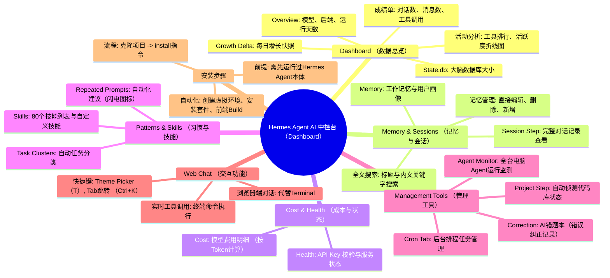

## 图谱（Obsidian 预览中打开）

```mermaid
mindmap
root((Hermes Agent AI 中控台 （Dashboard）))
  Dashboard （数据总览）
    Overview: 模型、后端、运行天数
    State.db: 大脑数据库大小
    成绩单: 对话数、消息数、工具调用
    Growth Delta: 每日增长快照
    活动分析: 工具排行、活跃度折线图
  Memory & Sessions （记忆与会话）
    Memory: 工作记忆与用户画像
    记忆管理: 直接编辑、删除、新增
    Session Step: 完整对话记录查看
    全文搜索: 标题与内文关键字搜索
  Cost & Health （成本与状态）
    Cost: 模型费用明细 （按Token计算）
    Health: API Key 校验与服务状态
  Patterns & Skills （习惯与技能）
    Task Clusters: 自动任务分类
    Repeated Prompts: 自动化建议（闪电图标）
    Skills: 80个技能列表与自定义技能
  Management Tools （管理工具）
    Cron Tab: 后台排程任务管理
    Project Step: 自动侦测代码库状态
    Agent Monitor: 全台电脑Agent运行监测
    Correction: AI错题本（错误纠正记录）
  Web Chat （交互功能）
    浏览器端对话: 代替Terminal
    实时工具调用: 终端命令执行
    快捷键: Theme Picker （T）, Tab跳转 （Ctrl+K）
  安装步骤
    前提: 需先运行过Hermes Agent本体
    流程: 克隆项目 -> install指令
    自动化: 创建虚拟环境、安装套件、前端Build
```

## 与 Wiki 的链接

<!-- Stage C 完成后自动补充 wikilinks -->
