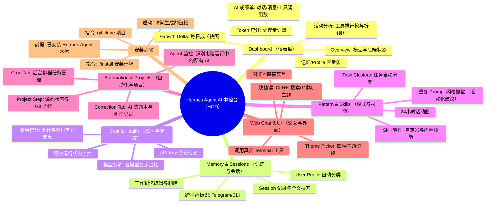

## 图谱（Obsidian 预览中打开）

```mermaid
mindmap
root((Hermes Agent AI 中控台 （HOD）))
  Dashboard （仪表盘）
    Overview: 模型与后端状态
    AI 成绩单: 对话/消息/工具调用数
    Token 统计: 处理量计算
    记忆/Profile 容量条
    Growth Delta: 每日成长快照
    活动分析: 工具排行榜与折线图
  Memory & Sessions （记忆与会话）
    工作记忆编辑与删除
    User Profile 自动分类
    Session 记录与全文搜索
    跨平台标识: Telegram/CLI
  Cost & Health （成本与健康）
    费用统计: 累计与单日美元支出
    模型拆解: 各模型费用占比
    API Key 状态检查
    服务运行状态监控
  Pattern & Skills （模式与技能）
    Task Clusters: 任务自动分类
    24小时活动图
    重复 Prompt 闪电提醒 （自动化建议）
    Skill 管理: 自定义与内置技能
  Automation & Projects （自动化与项目）
    Cron Tab: 后台排程任务管理
    Project Step: 源码状态与 Git 监控
    Agent 监控: 识别电脑运行中的所有 AI
    Correction Tab: AI 错题本与纠正记录
  Web Chat & UI （交互与界面）
    浏览器直接交互
    调用真实 Terminal 工具
    Theme Picker: 四种主题切换
    快捷键: Ctrl+K 搜索/T键切主题
  安装步骤
    前提: 已安装 Hermes Agent 本体
    指令: git clone 项目
    指令: ./install 安装环境
    启动: 访问生成的链接
```

## 与 Wiki 的链接

<!-- Stage C 完成后自动补充 wikilinks -->
