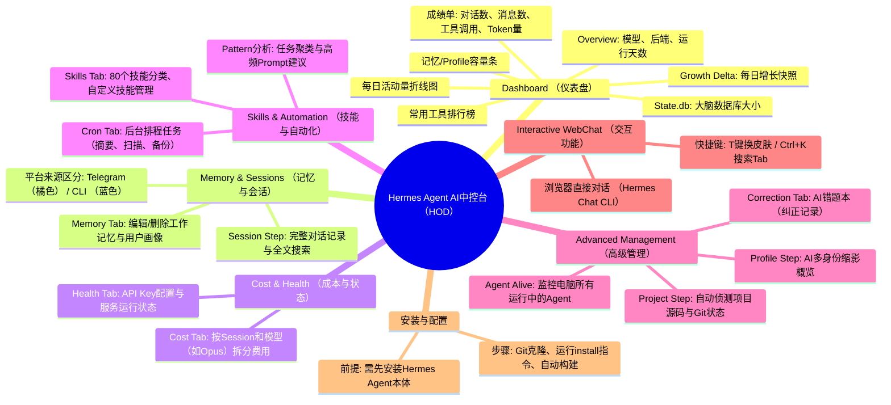

## 图谱（Obsidian 预览中打开）

```mermaid
mindmap
root((Hermes Agent AI中控台 （HOD）))
  Dashboard （仪表盘）
    Overview: 模型、后端、运行天数
    State.db: 大脑数据库大小
    成绩单: 对话数、消息数、工具调用、Token量
    记忆/Profile容量条
    Growth Delta: 每日增长快照
    常用工具排行榜
    每日活动量折线图
  Memory & Sessions （记忆与会话）
    Memory Tab: 编辑/删除工作记忆与用户画像
    Session Step: 完整对话记录与全文搜索
    平台来源区分: Telegram （橘色） / CLI （蓝色）
  Cost & Health （成本与状态）
    Cost Tab: 按Session和模型（如Opus）拆分费用
    Health Tab: API Key配置与服务运行状态
  Skills & Automation （技能与自动化）
    Skills Tab: 80个技能分类、自定义技能管理
    Cron Tab: 后台排程任务 （摘要、扫描、备份）
    Pattern分析: 任务聚类与高频Prompt建议
  Advanced Management （高级管理）
    Project Step: 自动侦测项目源码与Git状态
    Profile Step: AI多身份缩影概览
    Correction Tab: AI错题本 （纠正记录）
    Agent Alive: 监控电脑所有运行中的Agent
  Interactive WebChat （交互功能）
    浏览器直接对话 （Hermes Chat CLI）
    快捷键: T键换皮肤 / Ctrl+K搜索Tab
  安装与配置
    前提: 需先安装Hermes Agent本体
    步骤: Git克隆、运行install指令、自动构建
```

## 与 Wiki 的链接

<!-- Stage C 完成后自动补充 wikilinks -->
