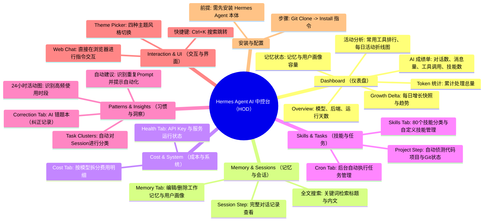

## 图谱（Obsidian 预览中打开）

```mermaid
mindmap
root((Hermes Agent AI 中控台 （HOD）))
  Dashboard （仪表盘）
    Overview: 模型、后端、运行天数
    AI 成绩单: 对话数、消息量、工具调用、技能数
    Token 统计: 累计处理总量
    记忆状态: 记忆与用户画像容量
    Growth Delta: 每日增长快照与趋势
    活动分析: 常用工具排行、每日活动折线图
  Memory & Sessions （记忆与会话）
    Memory Tab: 编辑/删除工作记忆与用户画像
    Session Step: 完整对话记录查看
    全文搜索: 关键词检索标题与内文
  Cost & System （成本与系统）
    Cost Tab: 按模型拆分费用明细
    Health Tab: API Key 与服务运行状态
  Skills & Tasks （技能与任务）
    Skills Tab: 80个技能分类与自定义技能管理
    Cron Tab: 后台自动执行任务管理
    Project Step: 自动侦测代码项目与Git状态
  Patterns & Insights （习惯与洞察）
    Task Clusters: 自动对Session进行分类
    24小时活动图: 识别高频使用时段
    自动建议: 识别重复Prompt并提示自动化
    Correction Tab: AI 错题本（纠正记录）
  Interaction & UI （交互与界面）
    Web Chat: 直接在浏览器进行指令交互
    Theme Picker: 四种主题风格切换
    快捷键: Ctrl+K 搜索跳转
  安装与配置
    前提: 需先安装 Hermes Agent 本体
    步骤: Git Clone -> Install 指令
```

## 与 Wiki 的链接

<!-- Stage C 完成后自动补充 wikilinks -->
