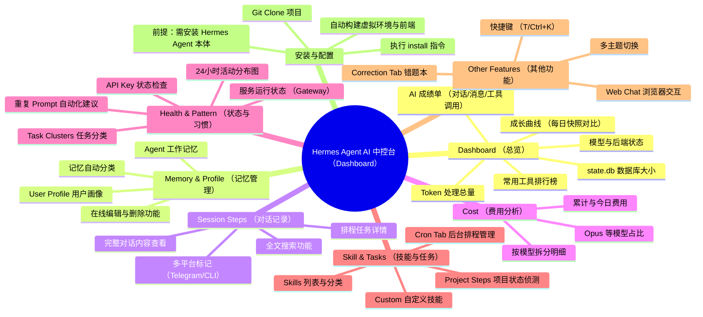

## 图谱（Obsidian 预览中打开）

```mermaid
mindmap
root((Hermes Agent AI 中控台 （Dashboard）))
  Dashboard （总览）
    模型与后端状态
    state.db 数据库大小
    AI 成绩单 （对话/消息/工具调用）
    Token 处理总量
    成长曲线 （每日快照对比）
    常用工具排行榜
  Memory & Profile （记忆管理）
    Agent 工作记忆
    User Profile 用户画像
    在线编辑与删除功能
    记忆自动分类
  Session Steps （对话记录）
    完整对话内容查看
    多平台标记 （Telegram/CLI）
    全文搜索功能
    排程任务详情
  Cost （费用分析）
    累计与今日费用
    按模型拆分明细
    Opus 等模型占比
  Health & Pattern （状态与习惯）
    API Key 状态检查
    服务运行状态 （Gateway）
    Task Clusters 任务分类
    24小时活动分布图
    重复 Prompt 自动化建议
  Skill & Tasks （技能与任务）
    Skills 列表与分类
    Custom 自定义技能
    Cron Tab 后台排程管理
    Project Steps 项目状态侦测
  Other Features （其他功能）
    Correction Tab 错题本
    Web Chat 浏览器交互
    快捷键 （T/Ctrl+K）
    多主题切换
  安装与配置
    前提：需安装 Hermes Agent 本体
    Git Clone 项目
    执行 install 指令
    自动构建虚拟环境与前端
```

## 与 Wiki 的链接

<!-- Stage C 完成后自动补充 wikilinks -->
