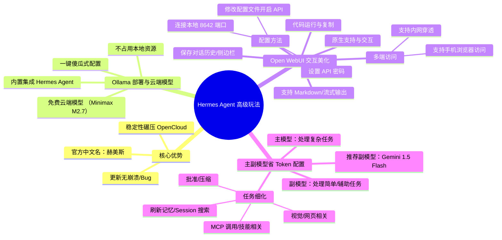

## 图谱（Obsidian 预览中打开）

```mermaid
mindmap
root((Hermes Agent 高级玩法))
  核心优势
    稳定性碾压 OpenCloud
    更新无崩溃/Bug
    官方中文名：赫美斯
  Ollama 部署与云端模型
    内置集成 Hermes Agent
    一键傻瓜式配置
    免费云端模型 （Minimax M2.7）
    不占用本地资源
  Open WebUI 交互美化
    原生支持与交互
    保存对话历史/侧边栏
    支持 Markdown/流式输出
    代码运行与复制
    配置方法
      修改配置文件开启 API
      设置 API 密码
      连接本地 8642 端口
    多端访问
      支持手机浏览器访问
      支持内网穿透
  主副模型省 Token 配置
    主模型：处理复杂任务
    副模型：处理简单/辅助任务
    任务细化
      批准/压缩
      刷新记忆/Session 搜索
      MCP 调用/技能相关
      视觉/网页相关
    推荐副模型：Gemini 1.5 Flash
```

## 与 Wiki 的链接

<!-- Stage C 完成后自动补充 wikilinks -->
