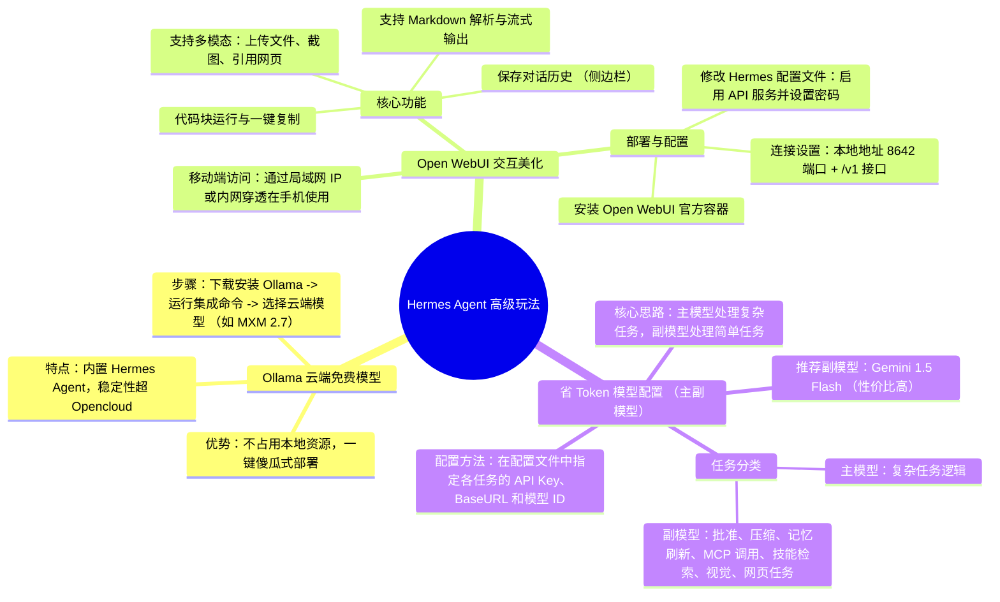

## 图谱（Obsidian 预览中打开）

```mermaid
mindmap
root((Hermes Agent 高级玩法))
  Ollama 云端免费模型
    特点：内置 Hermes Agent，稳定性超 Opencloud
    优势：不占用本地资源，一键傻瓜式部署
    步骤：下载安装 Ollama -> 运行集成命令 -> 选择云端模型 （如 MXM 2.7）
  Open WebUI 交互美化
    核心功能
      保存对话历史 （侧边栏）
      支持 Markdown 解析与流式输出
      代码块运行与一键复制
      支持多模态：上传文件、截图、引用网页
    部署与配置
      安装 Open WebUI 官方容器
      修改 Hermes 配置文件：启用 API 服务并设置密码
      连接设置：本地地址 8642 端口 + /v1 接口
    移动端访问：通过局域网 IP 或内网穿透在手机使用
  省 Token 模型配置 （主副模型）
    核心思路：主模型处理复杂任务，副模型处理简单任务
    任务分类
      主模型：复杂任务逻辑
      副模型：批准、压缩、记忆刷新、MCP 调用、技能检索、视觉、网页任务
    推荐副模型：Gemini 1.5 Flash （性价比高）
    配置方法：在配置文件中指定各任务的 API Key、BaseURL 和模型 ID
```

## 与 Wiki 的链接

<!-- Stage C 完成后自动补充 wikilinks -->
