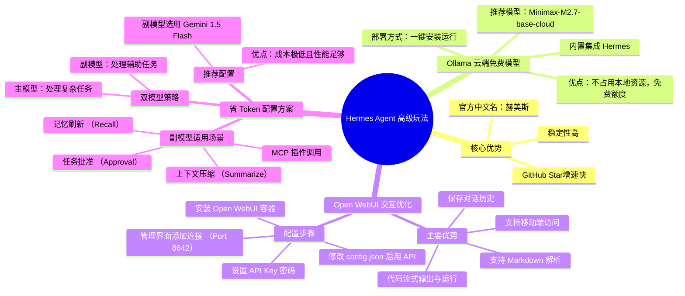

## 图谱（Obsidian 预览中打开）

```mermaid
mindmap
root((Hermes Agent 高级玩法))
  核心优势
    稳定性高
    官方中文名：赫美斯
    GitHub Star增速快
  Ollama 云端免费模型
    内置集成 Hermes
    部署方式：一键安装运行
    推荐模型：Minimax-M2.7-base-cloud
    优点：不占用本地资源，免费额度
  Open WebUI 交互优化
    主要优势
      保存对话历史
      支持 Markdown 解析
      代码流式输出与运行
      支持移动端访问
    配置步骤
      安装 Open WebUI 容器
      修改 config.json 启用 API
      设置 API Key 密码
      管理界面添加连接 （Port 8642）
  省 Token 配置方案
    双模型策略
      主模型：处理复杂任务
      副模型：处理辅助任务
    副模型适用场景
      任务批准 （Approval）
      上下文压缩 （Summarize）
      记忆刷新 （Recall）
      MCP 插件调用
    推荐配置
      副模型选用 Gemini 1.5 Flash
      优点：成本极低且性能足够
```

## 与 Wiki 的链接

<!-- Stage C 完成后自动补充 wikilinks -->
