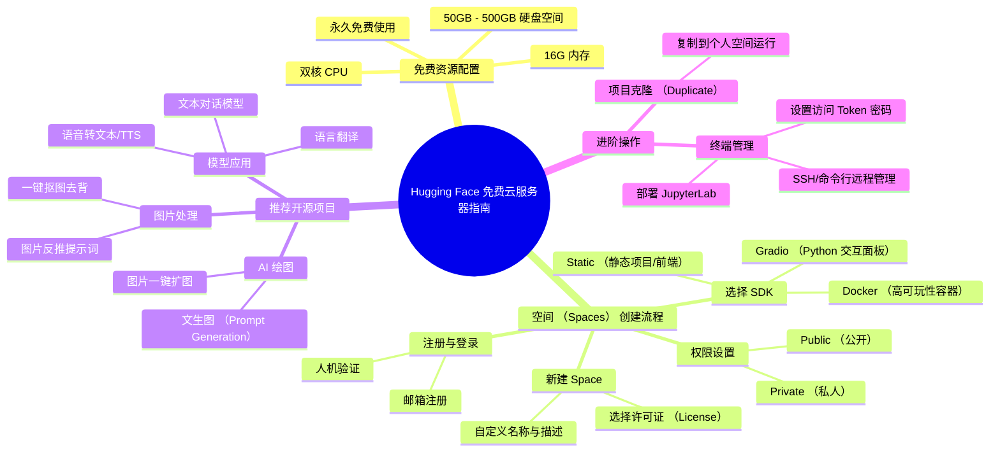

## 图谱（Obsidian 预览中打开）

```mermaid
mindmap
root((Hugging Face 免费云服务器指南))
  免费资源配置
    双核 CPU
    16G 内存
    50GB - 500GB 硬盘空间
    永久免费使用
  空间 （Spaces） 创建流程
    注册与登录
      邮箱注册
      人机验证
    新建 Space
      自定义名称与描述
      选择许可证 （License）
    选择 SDK
      Gradio （Python 交互面板）
      Docker （高可玩性容器）
      Static （静态项目/前端）
    权限设置
      Public （公开）
      Private （私人）
  推荐开源项目
    AI 绘图
      文生图 （Prompt Generation）
      图片一键扩图
    图片处理
      图片反推提示词
      一键抠图去背
    模型应用
      文本对话模型
      语音转文本/TTS
      语言翻译
  进阶操作
    项目克隆 （Duplicate）
      复制到个人空间运行
    终端管理
      部署 JupyterLab
      SSH/命令行远程管理
      设置访问 Token 密码
```

## 与 Wiki 的链接

<!-- Stage C 完成后自动补充 wikilinks -->
