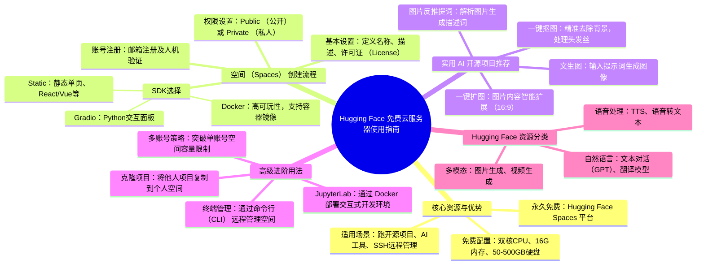

## 图谱（Obsidian 预览中打开）

```mermaid
mindmap
root((Hugging Face 免费云服务器使用指南))
  核心资源与优势
    免费配置：双核CPU、16G内存、50-500GB硬盘
    永久免费：Hugging Face Spaces 平台
    适用场景：跑开源项目、AI工具、SSH远程管理
  空间 （Spaces） 创建流程
    账号注册：邮箱注册及人机验证
    基本设置：定义名称、描述、许可证 （License）
    SDK选择
      Gradio：Python交互面板
      Docker：高可玩性，支持容器镜像
      Static：静态单页、React/Vue等
    权限设置：Public （公开） 或 Private （私人）
  实用 AI 开源项目推荐
    文生图：输入提示词生成图像
    图片反推提词：解析图片生成描述词
    一键抠图：精准去除背景，处理头发丝
    一键扩图：图片内容智能扩展 （16:9）
  高级进阶用法
    克隆项目：将他人项目复制到个人空间
    JupyterLab：通过 Docker 部署交互式开发环境
    终端管理：通过命令行 （CLI） 远程管理空间
    多账号策略：突破单账号空间容量限制
  Hugging Face 资源分类
    多模态：图片生成、视频生成
    自然语言：文本对话 （GPT）、翻译模型
    语音处理：TTS、语音转文本
```

## 与 Wiki 的链接

<!-- Stage C 完成后自动补充 wikilinks -->
