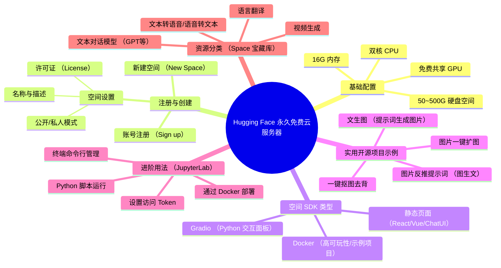

## 图谱（Obsidian 预览中打开）

```mermaid
mindmap
root((Hugging Face 永久免费云服务器))
  基础配置
    双核 CPU
    16G 内存
    50~500G 硬盘空间
    免费共享 GPU
  注册与创建
    账号注册 （Sign up）
    新建空间 （New Space）
    空间设置
      名称与描述
      许可证 （License）
      公开/私人模式
  空间 SDK 类型
    Gradio （Python 交互面板）
    Docker （高可玩性/示例项目）
    静态页面 （React/Vue/ChatUI）
  实用开源项目示例
    文生图 （提示词生成图片）
    图片反推提示词 （图生文）
    一键抠图去背
    图片一键扩图
  进阶用法 （JupyterLab）
    通过 Docker 部署
    设置访问 Token
    终端命令行管理
    Python 脚本运行
  资源分类 （Space 宝藏库）
    视频生成
    文本对话模型 （GPT等）
    语言翻译
    文本转语音/语音转文本
```

## 与 Wiki 的链接

<!-- Stage C 完成后自动补充 wikilinks -->
