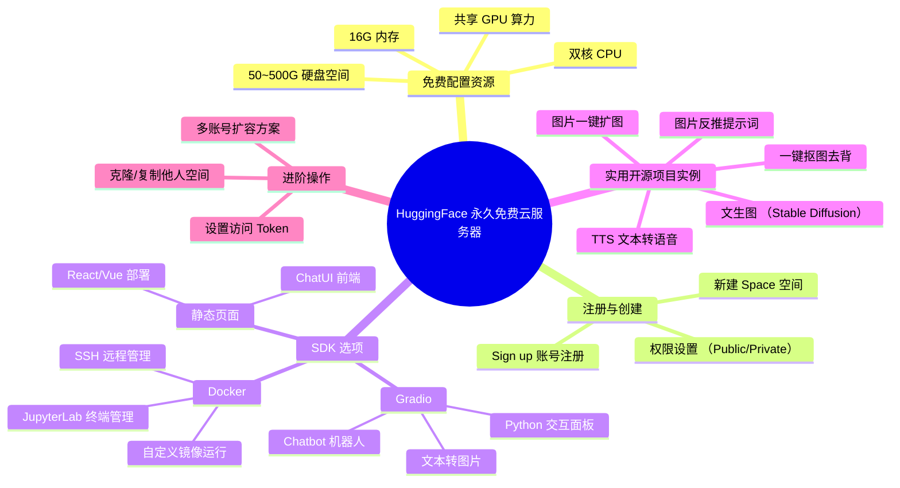

## 图谱（Obsidian 预览中打开）

```mermaid
mindmap
root((HuggingFace 永久免费云服务器))
  免费配置资源
    双核 CPU
    16G 内存
    50~500G 硬盘空间
    共享 GPU 算力
  注册与创建
    Sign up 账号注册
    新建 Space 空间
    权限设置 （Public/Private）
  SDK 选项
    Gradio
      Python 交互面板
      文本转图片
      Chatbot 机器人
    Docker
      自定义镜像运行
      JupyterLab 终端管理
      SSH 远程管理
    静态页面
      React/Vue 部署
      ChatUI 前端
  实用开源项目实例
    文生图 （Stable Diffusion）
    图片反推提示词
    一键抠图去背
    图片一键扩图
    TTS 文本转语音
  进阶操作
    克隆/复制他人空间
    设置访问 Token
    多账号扩容方案
```

## 与 Wiki 的链接

<!-- Stage C 完成后自动补充 wikilinks -->
