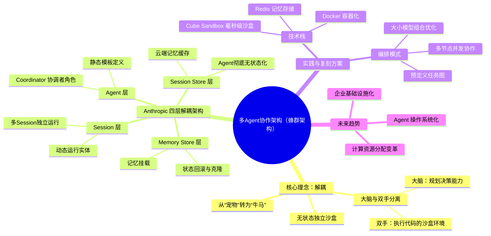

## 图谱（Obsidian 预览中打开）

```mermaid
mindmap
root((多Agent协作架构（蜂群架构）))
  核心理念：解耦
    大脑与双手分离
      大脑：规划决策能力
      双手：执行代码的沙盒环境
    从“宠物”转为“牛马”
    无状态独立沙盒
  Anthropic 四层解耦架构
    Agent 层
      静态模板定义
      Coordinator 协调者角色
    Session 层
      动态运行实体
      多Session独立运行
    Memory Store 层
      记忆挂载
      状态回滚与克隆
    Session Store 层
      云端记忆缓存
      Agent彻底无状态化
  实践与复刻方案
    技术栈
      Docker 容器化
      Redis 记忆存储
      Cube Sandbox 毫秒级沙盒
    编排模式
      预定义任务图
      多节点并发协作
      大小模型组合优化
  未来趋势
    Agent 操作系统化
    企业基础设施化
    计算资源分配变革
```

## 与 Wiki 的链接

<!-- Stage C 完成后自动补充 wikilinks -->
