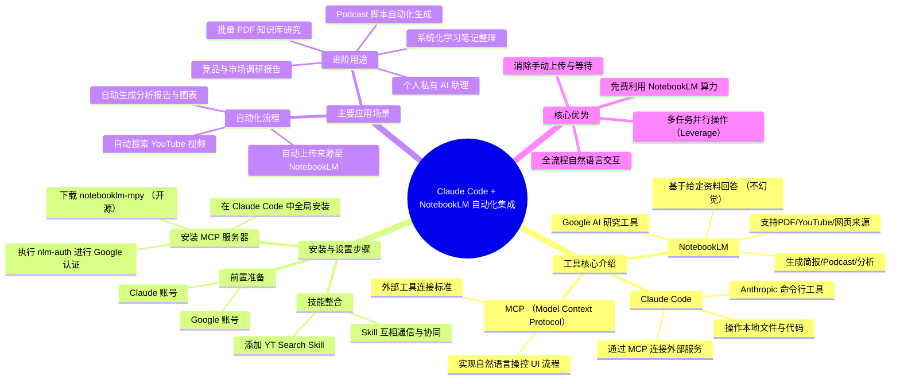

## 图谱（Obsidian 预览中打开）

```mermaid
mindmap
root((Claude Code + NotebookLM 自动化集成))
  工具核心介绍
    NotebookLM
      Google AI 研究工具
      支持PDF/YouTube/网页来源
      基于给定资料回答 （不幻觉）
      生成简报/Podcast/分析
    Claude Code
      Anthropic 命令行工具
      操作本地文件与代码
      通过 MCP 连接外部服务
    MCP （Model Context Protocol）
      外部工具连接标准
      实现自然语言操控 UI 流程
  安装与设置步骤
    前置准备
      Claude 账号
      Google 账号
    安装 MCP 服务器
      下载 notebooklm-mpy （开源）
      在 Claude Code 中全局安装
      执行 nlm-auth 进行 Google 认证
    技能整合
      添加 YT Search Skill
      Skill 互相通信与协同
  主要应用场景
    自动化流程
      自动搜索 YouTube 视频
      自动上传来源至 NotebookLM
      自动生成分析报告与图表
    进阶用途
      批量 PDF 知识库研究
      Podcast 脚本自动化生成
      竞品与市场调研报告
      系统化学习笔记整理
      个人私有 AI 助理
  核心优势
    全流程自然语言交互
    消除手动上传与等待
    多任务并行操作 （Leverage）
    免费利用 NotebookLM 算力
```

## 与 Wiki 的链接

<!-- Stage C 完成后自动补充 wikilinks -->
