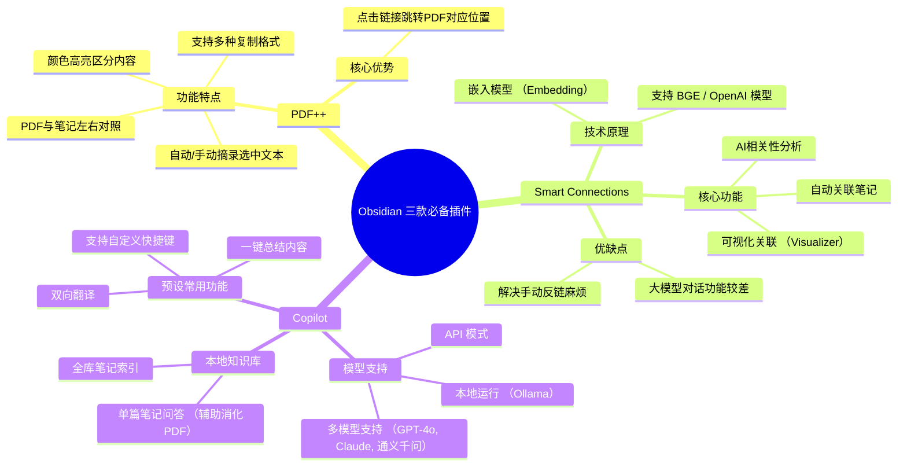

## 图谱（Obsidian 预览中打开）

```mermaid
mindmap
root((Obsidian 三款必备插件))
  PDF++
    功能特点
      PDF与笔记左右对照
      自动/手动摘录选中文本
      颜色高亮区分内容
      支持多种复制格式
    核心优势
      点击链接跳转PDF对应位置
  Smart Connections
    核心功能
      自动关联笔记
      AI相关性分析
      可视化关联 （Visualizer）
    技术原理
      嵌入模型 （Embedding）
      支持 BGE / OpenAI 模型
    优缺点
      解决手动反链麻烦
      大模型对话功能较差
  Copilot
    模型支持
      多模型支持 （GPT-4o, Claude, 通义千问）
      本地运行 （Ollama）
      API 模式
    本地知识库
      全库笔记索引
      单篇笔记问答 （辅助消化PDF）
    预设常用功能
      一键总结内容
      双向翻译
      支持自定义快捷键
```

## 与 Wiki 的链接

<!-- Stage C 完成后自动补充 wikilinks -->
