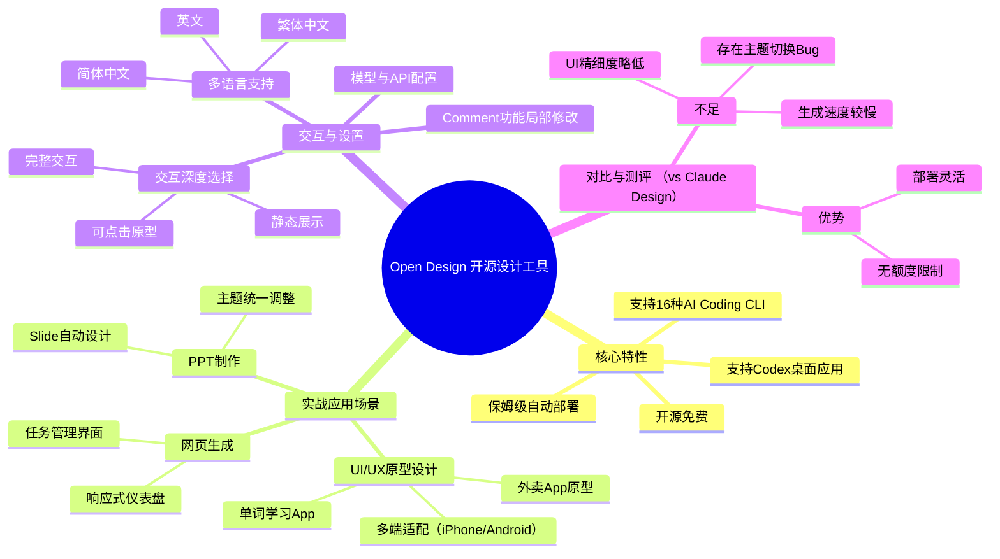

## 图谱（Obsidian 预览中打开）

```mermaid
mindmap
root((Open Design 开源设计工具))
  核心特性
    开源免费
    支持16种AI Coding CLI
    支持Codex桌面应用
    保姆级自动部署
  实战应用场景
    UI/UX原型设计
      外卖App原型
      单词学习App
      多端适配（iPhone/Android）
    网页生成
      响应式仪表盘
      任务管理界面
    PPT制作
      Slide自动设计
      主题统一调整
  交互与设置
    交互深度选择
      静态展示
      可点击原型
      完整交互
    多语言支持
      简体中文
      繁体中文
      英文
    模型与API配置
    Comment功能局部修改
  对比与测评 （vs Claude Design）
    优势
      无额度限制
      部署灵活
    不足
      UI精细度略低
      生成速度较慢
      存在主题切换Bug
```

## 与 Wiki 的链接

<!-- Stage C 完成后自动补充 wikilinks -->
