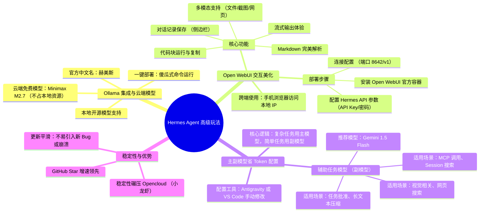

## 图谱（Obsidian 预览中打开）

```mermaid
mindmap
root((Hermes Agent 高级玩法))
  Ollama 集成与云端模型
    一键部署：傻瓜式命令运行
    云端免费模型：Minimax M2.7 （不占本地资源）
    本地开源模型支持
    官方中文名：赫美斯
  Open WebUI 交互美化
    核心功能
      对话记录保存 （侧边栏）
      Markdown 完美解析
      代码块运行与复制
      流式输出体验
      多模态支持 （文件/截图/网页）
    部署步骤
      安装 Open WebUI 官方容器
      配置 Hermes API 参数 （API Key/密码）
      连接配置 （端口 8642/v1）
    跨端使用：手机浏览器访问本地 IP
  主副模型省 Token 配置
    核心逻辑：复杂任务用主模型，简单任务用副模型
    辅助任务模型 （副模型）
      推荐模型：Gemini 1.5 Flash
      适用场景：任务批准、长文本压缩
      适用场景：MCP 调用、Session 搜索
      适用场景：视觉相关、网页搜索
    配置工具：Antigravity 或 VS Code 手动修改
  稳定性与优势
    稳定性碾压 Opencloud （小龙虾）
    更新平滑：不易引入新 Bug 或崩溃
    GitHub Star 增速领先
```

## 与 Wiki 的链接

<!-- Stage C 完成后自动补充 wikilinks -->
