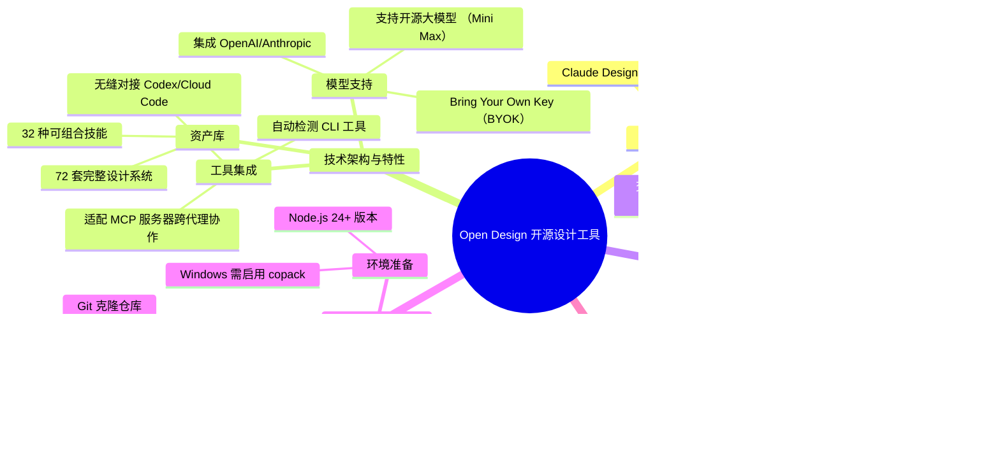

## 图谱（Obsidian 预览中打开）

```mermaid
mindmap
root((Open Design 开源设计工具))
  核心定位与优势
    Claude Design 强力平替
    完全免费且开源
    本地部署，保护隐私
    无订阅限制与额度瓶颈
  技术架构与特性
    模型支持
      Bring Your Own Key （BYOK）
      集成 OpenAI/Anthropic
      支持开源大模型 （Mini Max）
    工具集成
      自动检测 CLI 工具
      适配 MCP 服务器跨代理协作
      无缝对接 Codex/Cloud Code
    资产库
      32 种可组合技能
      72 套完整设计系统
  主要功能
    自然语言转 UI/原型设计
    本地文件系统读写
    多格式导出 （HTML/PDF/PPT）
    交互式区域修改 （注视功能）
    实时预览与源码查看
  安装与使用流程
    环境准备
      Node.js 24+ 版本
      Windows 需启用 copack
    部署步骤
      Git 克隆仓库
      pnpm install 安装依赖
      启动本地链接
    项目配置
      选择运行模式
      配置推理力度与媒体提供商
  实测表现
    清爽灵敏的交互界面
    高保真视觉产出
    代码整洁无冗余
    支持复杂图文排版
```

## 与 Wiki 的链接

<!-- Stage C 完成后自动补充 wikilinks -->
