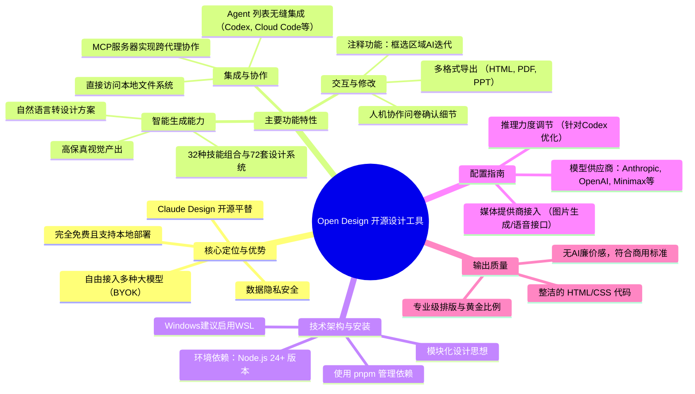

## 图谱（Obsidian 预览中打开）

```mermaid
mindmap
root((Open Design 开源设计工具))
  核心定位与优势
    Claude Design 开源平替
    完全免费且支持本地部署
    自由接入多种大模型 （BYOK）
    数据隐私安全
  主要功能特性
    智能生成能力
      自然语言转设计方案
      32种技能组合与72套设计系统
      高保真视觉产出
    集成与协作
      Agent 列表无缝集成 （Codex, Cloud Code等）
      MCP服务器实现跨代理协作
      直接访问本地文件系统
    交互与修改
      注释功能：框选区域AI迭代
      人机协作问卷确认细节
      多格式导出 （HTML, PDF, PPT）
  技术架构与安装
    环境依赖：Node.js 24+ 版本
    Windows建议启用WSL
    使用 pnpm 管理依赖
    模块化设计思想
  配置指南
    模型供应商：Anthropic, OpenAI, Minimax等
    推理力度调节 （针对Codex优化）
    媒体提供商接入 （图片生成/语音接口）
  输出质量
    专业级排版与黄金比例
    整洁的 HTML/CSS 代码
    无AI廉价感，符合商用标准
```

## 与 Wiki 的链接

<!-- Stage C 完成后自动补充 wikilinks -->
