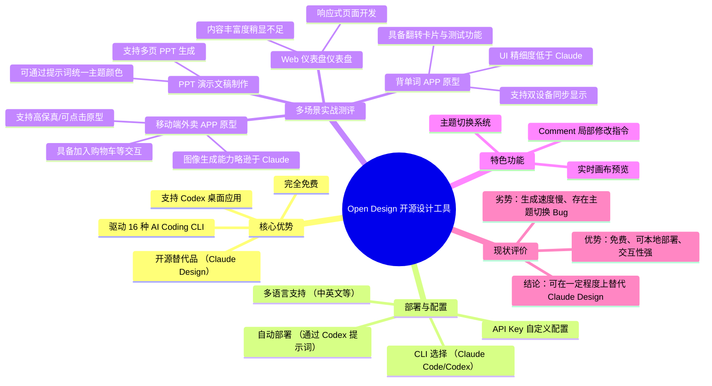

## 图谱（Obsidian 预览中打开）

```mermaid
mindmap
root((Open Design 开源设计工具))
  核心优势
    完全免费
    开源替代品 （Claude Design）
    驱动 16 种 AI Coding CLI
    支持 Codex 桌面应用
  部署与配置
    自动部署 （通过 Codex 提示词）
    CLI 选择 （Claude Code/Codex）
    多语言支持 （中英文等）
    API Key 自定义配置
  多场景实战测评
    移动端外卖 APP 原型
      支持高保真/可点击原型
      具备加入购物车等交互
      图像生成能力略逊于 Claude
    背单词 APP 原型
      支持双设备同步显示
      具备翻转卡片与测试功能
      UI 精细度低于 Claude
    Web 仪表盘仪表盘
      响应式页面开发
      内容丰富度稍显不足
    PPT 演示文稿制作
      支持多页 PPT 生成
      可通过提示词统一主题颜色
  特色功能
    主题切换系统
    Comment 局部修改指令
    实时画布预览
  现状评价
    优势：免费、可本地部署、交互性强
    劣势：生成速度慢、存在主题切换 Bug
    结论：可在一定程度上替代 Claude Design
```

## 与 Wiki 的链接

<!-- Stage C 完成后自动补充 wikilinks -->
