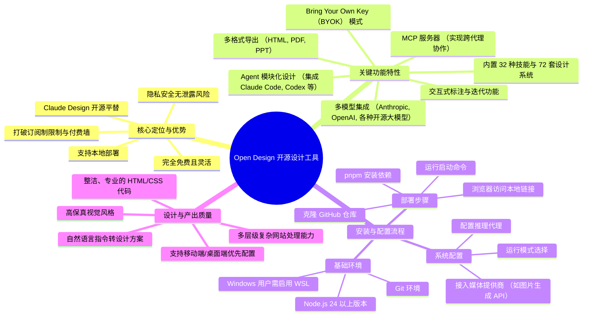

## 图谱（Obsidian 预览中打开）

```mermaid
mindmap
root((Open Design 开源设计工具))
  核心定位与优势
    Claude Design 开源平替
    完全免费且灵活
    支持本地部署
    隐私安全无泄露风险
    打破订阅制限制与付费墙
  关键功能特性
    Bring Your Own Key （BYOK） 模式
    多模型集成 （Anthropic, OpenAI, 各种开源大模型）
    Agent 模块化设计 （集成 Claude Code, Codex 等）
    MCP 服务器 （实现跨代理协作）
    内置 32 种技能与 72 套设计系统
    多格式导出 （HTML, PDF, PPT）
    交互式标注与迭代功能
  安装与配置流程
    基础环境
      Node.js 24 以上版本
      Git 环境
      Windows 用户需启用 WSL
    部署步骤
      克隆 GitHub 仓库
      pnpm 安装依赖
      运行启动命令
      浏览器访问本地链接
    系统配置
      运行模式选择
      配置推理代理
      接入媒体提供商 （如图片生成 API）
  设计与产出质量
    自然语言指令转设计方案
    高保真视觉风格
    整洁、专业的 HTML/CSS 代码
    支持移动端/桌面端优先配置
    多层级复杂网站处理能力
```

## 与 Wiki 的链接

<!-- Stage C 完成后自动补充 wikilinks -->
