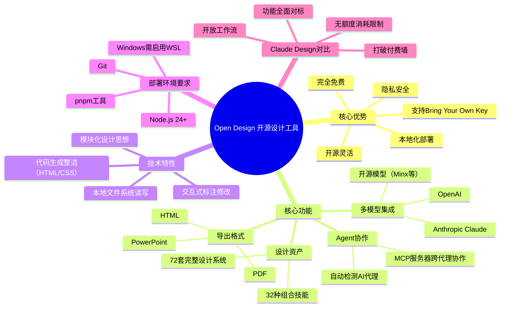

## 图谱（Obsidian 预览中打开）

```mermaid
mindmap
root((Open Design 开源设计工具))
  核心优势
    完全免费
    开源灵活
    本地化部署
    支持Bring Your Own Key
    隐私安全
  核心功能
    多模型集成
      Anthropic Claude
      OpenAI
      开源模型（Minx等）
    Agent协作
      自动检测AI代理
      MCP服务器跨代理协作
    设计资产
      32种组合技能
      72套完整设计系统
    导出格式
      HTML
      PDF
      PowerPoint
  技术特性
    本地文件系统读写
    模块化设计思想
    代码生成整洁（HTML/CSS）
    交互式标注修改
  部署环境要求
    Node.js 24+
    Git
    pnpm工具
    Windows需启用WSL
  Claude Design对比
    打破付费墙
    无额度消耗限制
    开放工作流
    功能全面对标
```

## 与 Wiki 的链接

<!-- Stage C 完成后自动补充 wikilinks -->
