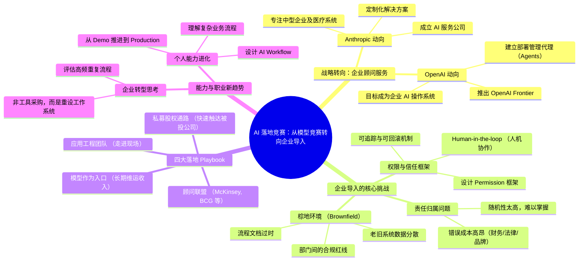

## 图谱（Obsidian 预览中打开）

```mermaid
mindmap
root((AI 落地竞赛：从模型竞赛转向企业导入))
  战略转向：企业顾问服务
    Anthropic 动向
      成立 AI 服务公司
      定制化解决方案
      专注中型企业及医疗系统
    OpenAI 动向
      推出 OpenAI Frontier
      建立部署管理代理 （Agents）
      目标成为企业 AI 操作系统
  企业导入的核心挑战
    责任归属问题
      错误成本高昂（财务/法律/品牌）
      随机性太高，难以掌握
    权限与信任框架
      设计 Permission 框架
      Human-in-the-loop （人机协作）
      可追踪与可回滚机制
    棕地环境 （Brownfield）
      老旧系统数据分散
      流程文档过时
      部门间的合规红线
  四大落地 Playbook
    应用工程团队 （走进现场）
    顾问联盟 （McKinsey, BCG 等）
    私募股权通路 （快速触达被投公司）
    模型作为入口 （长期维运收入）
  能力与职业新趋势
    企业转型思考
      非工具采购，而是重设工作系统
      评估高频重复流程
    个人能力进化
      理解复杂业务流程
      设计 AI Workflow
      从 Demo 推进到 Production
```

## 与 Wiki 的链接

<!-- Stage C 完成后自动补充 wikilinks -->
