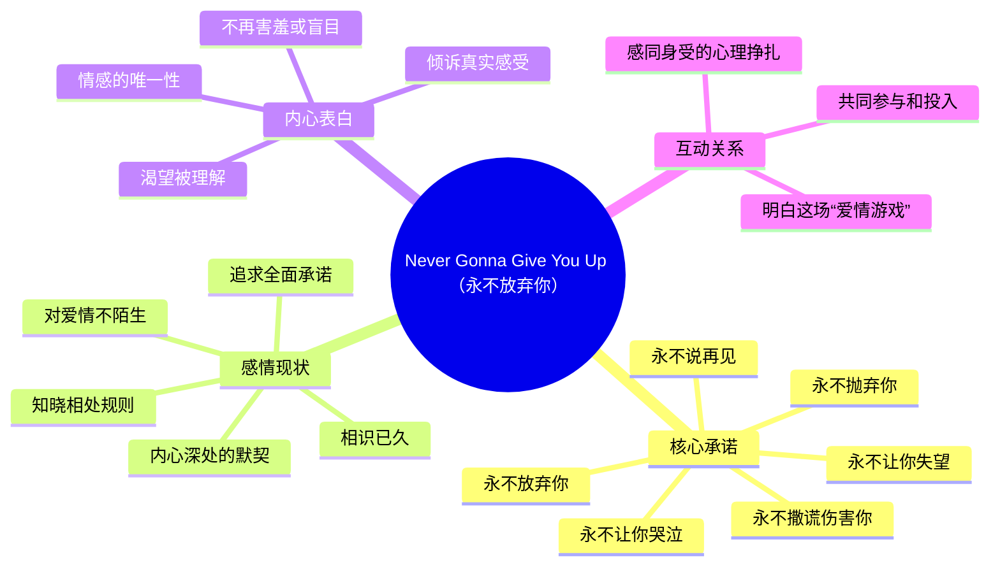

## 图谱（Obsidian 预览中打开）

```mermaid
mindmap
root((Never Gonna Give You Up （永不放弃你）))
  核心承诺
    永不放弃你
    永不让你失望
    永不抛弃你
    永不让你哭泣
    永不说再见
    永不撒谎伤害你
  感情现状
    对爱情不陌生
    知晓相处规则
    追求全面承诺
    内心深处的默契
    相识已久
  内心表白
    倾诉真实感受
    渴望被理解
    不再害羞或盲目
    情感的唯一性
  互动关系
    明白这场“爱情游戏”
    感同身受的心理挣扎
    共同参与和投入
```

## 与 Wiki 的链接

<!-- Stage C 完成后自动补充 wikilinks -->
