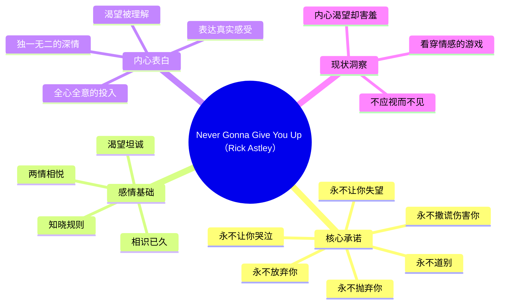

## 图谱（Obsidian 预览中打开）

```mermaid
mindmap
root((Never Gonna Give You Up （Rick Astley）))
  核心承诺
    永不放弃你
    永不让你失望
    永不抛弃你
    永不让你哭泣
    永不道别
    永不撒谎伤害你
  感情基础
    相识已久
    知晓规则
    渴望坦诚
    两情相悦
  内心表白
    全心全意的投入
    独一无二的深情
    渴望被理解
    表达真实感受
  现状洞察
    内心渴望却害羞
    看穿情感的游戏
    不应视而不见
```

## 与 Wiki 的链接

<!-- Stage C 完成后自动补充 wikilinks -->
