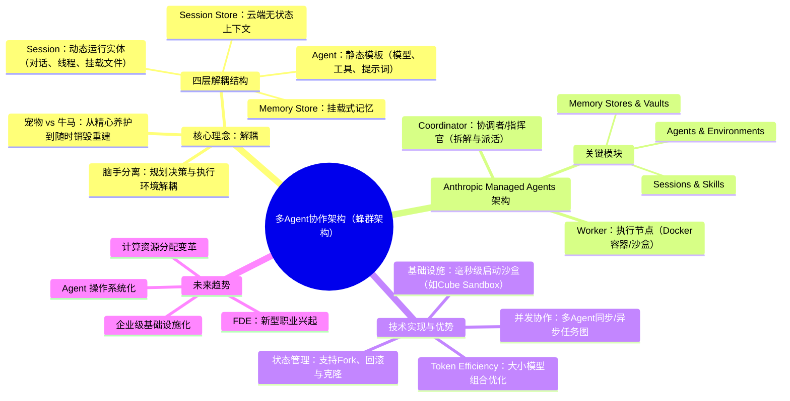

## 图谱（Obsidian 预览中打开）

```mermaid
mindmap
root((多Agent协作架构（蜂群架构）))
  核心理念：解耦
    脑手分离：规划决策与执行环境解耦
    宠物 vs 牛马：从精心养护到随时销毁重建
    四层解耦结构
      Agent：静态模板（模型、工具、提示词）
      Session：动态运行实体（对话、线程、挂载文件）
      Memory Store：挂载式记忆
      Session Store：云端无状态上下文
  Anthropic Managed Agents 架构
    Coordinator：协调者/指挥官（拆解与派活）
    Worker：执行节点（Docker容器/沙盒）
    关键模块
      Agents & Environments
      Sessions & Skills
      Memory Stores & Vaults
  技术实现与优势
    状态管理：支持Fork、回滚与克隆
    并发协作：多Agent同步/异步任务图
    Token Efficiency：大小模型组合优化
    基础设施：毫秒级启动沙盒（如Cube Sandbox）
  未来趋势
    Agent 操作系统化
    企业级基础设施化
    计算资源分配变革
    FDE：新型职业兴起
```

## 与 Wiki 的链接

<!-- Stage C 完成后自动补充 wikilinks -->
