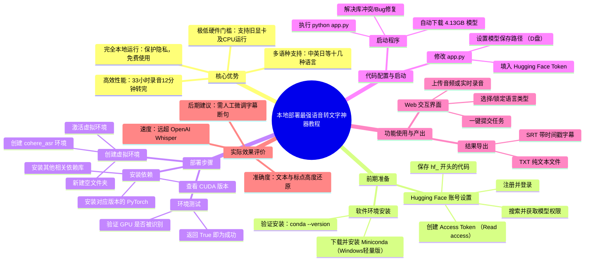

## 图谱（Obsidian 预览中打开）

```mermaid
mindmap
root((本地部署最强语音转文字神器教程))
  核心优势
    高效性能：33小时录音12分钟转完
    多语种支持：中英日等十几种语言
    完全本地运行：保护隐私，免费使用
    极低硬件门槛：支持旧显卡及CPU运行
  前期准备
    Hugging Face 账号设置
      注册并登录
      搜索并获取模型权限
      创建 Access Token （Read access）
      保存 hf_ 开头的代码
    软件环境安装
      下载并安装 Miniconda （Windows轻量版）
      验证安装：conda --version
  部署步骤
    创建虚拟环境
      新建空文件夹
      创建 cohere_asr 环境
      激活虚拟环境
    安装依赖
      查看 CUDA 版本
      安装对应版本的 PyTorch
      安装其他相关依赖库
    环境测试
      验证 GPU 是否被识别
      返回 True 即为成功
  代码配置与启动
    修改 app.py
      设置模型保存路径 （D盘）
      填入 Hugging Face Token
    启动程序
      执行 python app.py
      自动下载 4.13GB 模型
      解决库冲突/Bug修复
  功能使用与产出
    Web 交互界面
      上传音频或实时录音
      选择/锁定语言类型
      一键提交任务
    结果导出
      TXT 纯文本文件
      SRT 带时间戳字幕
  实际效果评价
    准确度：文本与标点高度还原
    速度：远超 OpenAI Whisper
    后期建议：需人工微调字幕断句
```

## 与 Wiki 的链接

<!-- Stage C 完成后自动补充 wikilinks -->
