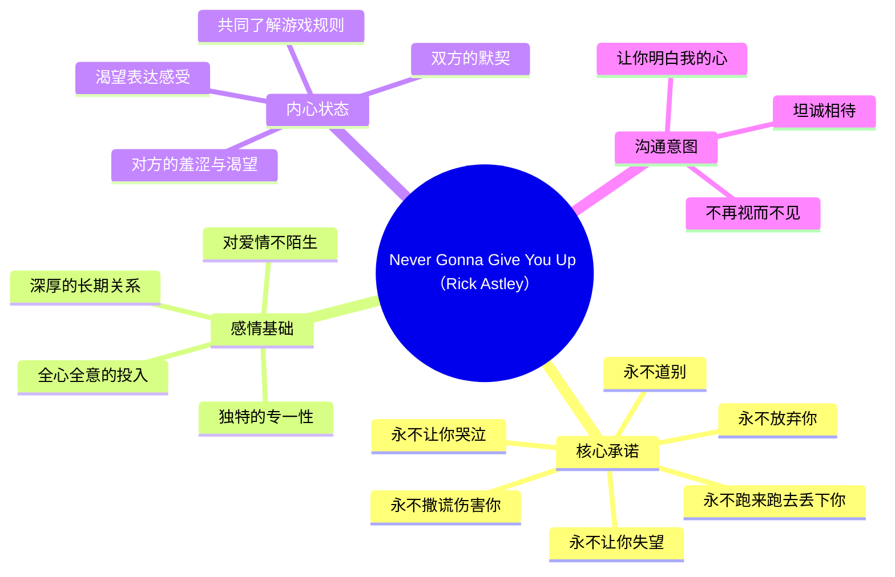

## 图谱（Obsidian 预览中打开）

```mermaid
mindmap
root((Never Gonna Give You Up （Rick Astley）))
  核心承诺
    永不放弃你
    永不让你失望
    永不跑来跑去丢下你
    永不让你哭泣
    永不道别
    永不撒谎伤害你
  感情基础
    对爱情不陌生
    深厚的长期关系
    全心全意的投入
    独特的专一性
  内心状态
    渴望表达感受
    共同了解游戏规则
    对方的羞涩与渴望
    双方的默契
  沟通意图
    让你明白我的心
    不再视而不见
    坦诚相待
```

## 与 Wiki 的链接

<!-- Stage C 完成后自动补充 wikilinks -->
