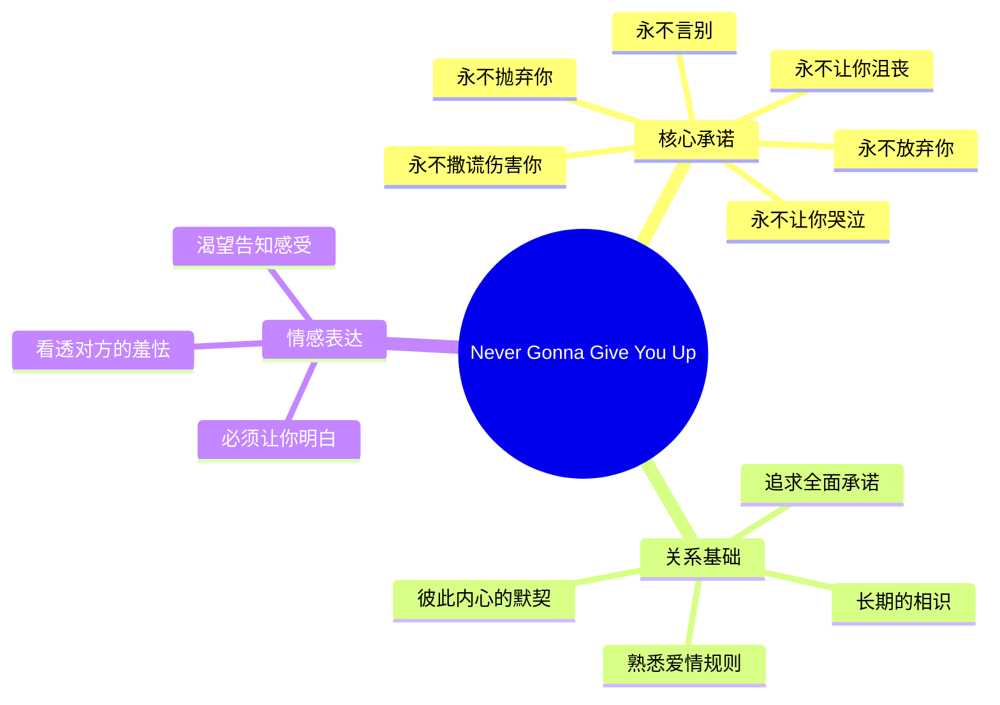

## 图谱（Obsidian 预览中打开）

```mermaid
mindmap
root((Never Gonna Give You Up))
  核心承诺
    永不放弃你
    永不让你沮丧
    永不抛弃你
    永不让你哭泣
    永不言别
    永不撒谎伤害你
  关系基础
    熟悉爱情规则
    追求全面承诺
    长期的相识
    彼此内心的默契
  情感表达
    渴望告知感受
    必须让你明白
    看透对方的羞怯
```

## 与 Wiki 的链接

<!-- Stage C 完成后自动补充 wikilinks -->
