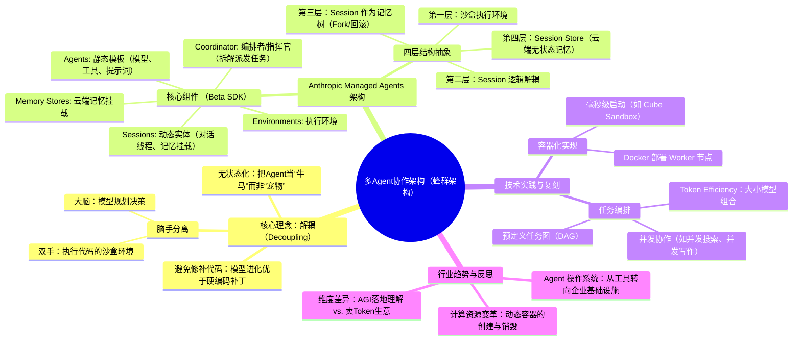

## 图谱（Obsidian 预览中打开）

```mermaid
mindmap
root((多Agent协作架构（蜂群架构）))
  核心理念：解耦（Decoupling）
    脑手分离
      大脑：模型规划决策
      双手：执行代码的沙盒环境
    无状态化：把Agent当“牛马”而非“宠物”
    避免修补代码：模型进化优于硬编码补丁
  Anthropic Managed Agents 架构
    核心组件 （Beta SDK）
      Agents: 静态模板（模型、工具、提示词）
      Sessions: 动态实体（对话线程、记忆挂载）
      Coordinator: 编排者/指挥官（拆解派发任务）
      Memory Stores: 云端记忆挂载
      Environments: 执行环境
    四层结构抽象
      第一层：沙盒执行环境
      第二层：Session 逻辑解耦
      第三层：Session 作为记忆树（Fork/回滚）
      第四层：Session Store（云端无状态记忆）
  技术实践与复刻
    容器化实现
      Docker 部署 Worker 节点
      毫秒级启动（如 Cube Sandbox）
    任务编排
      预定义任务图（DAG）
      并发协作（如并发搜索、并发写作）
      Token Efficiency：大小模型组合
  行业趋势与反思
    Agent 操作系统：从工具转向企业基础设施
    计算资源变革：动态容器的创建与销毁
    维度差异：AGI落地理解 vs. 卖Token生意
```

## 与 Wiki 的链接

<!-- Stage C 完成后自动补充 wikilinks -->
