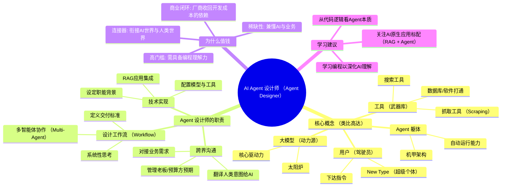

## 图谱（Obsidian 预览中打开）

```mermaid
mindmap
root((AI Agent 设计师 （Agent Designer）))
  核心概念 （类比高达）
    Agent 躯体
      机甲架构
      自动运行能力
    大模型 （动力源）
      太阳炉
      核心驱动力
    工具 （武器库）
      搜索工具
      抓取工具 （Scraping）
      数据库/软件打通
    用户 （驾驶员）
      下达指令
      New Type （超级个体）
  Agent 设计师的职责
    设计工作流 （Workflow）
      系统性思考
      定义交付标准
      多智能体协作 （Multi-Agent）
    跨界沟通
      翻译人类意图给AI
      对接业务需求
      管理老板/预算方预期
    技术实现
      设定职能背景
      配置模型与工具
      RAG应用集成
  为什么值钱
    商业闭环: 厂商收回开发成本的依赖
    稀缺性: 兼懂AI与业务
    连接器: 衔接AI世界与人类世界
    高门槛: 需具备编程理解力
  学习建议
    学习编程以深化AI理解
    从代码逻辑看Agent本质
    关注AI原生应用标配 （RAG + Agent）
```

## 与 Wiki 的链接

<!-- Stage C 完成后自动补充 wikilinks -->
