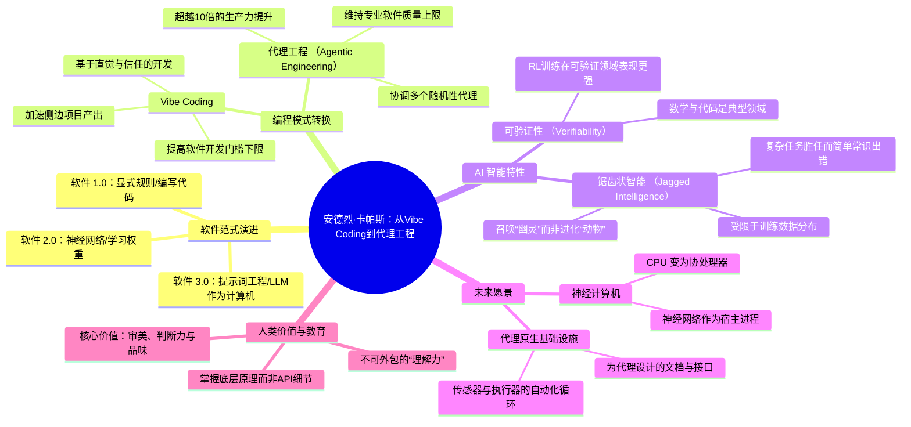

## 图谱（Obsidian 预览中打开）

```mermaid
mindmap
root((安德烈·卡帕斯：从Vibe Coding到代理工程))
  软件范式演进
    软件 1.0：显式规则/编写代码
    软件 2.0：神经网络/学习权重
    软件 3.0：提示词工程/LLM作为计算机
  编程模式转换
    Vibe Coding
      提高软件开发门槛下限
      基于直觉与信任的开发
      加速侧边项目产出
    代理工程 （Agentic Engineering）
      维持专业软件质量上限
      协调多个随机性代理
      超越10倍的生产力提升
  AI 智能特性
    可验证性 （Verifiability）
      RL训练在可验证领域表现更强
      数学与代码是典型领域
    锯齿状智能 （Jagged Intelligence）
      复杂任务胜任而简单常识出错
      受限于训练数据分布
      召唤“幽灵”而非进化“动物”
  未来愿景
    神经计算机
      神经网络作为宿主进程
      CPU 变为协处理器
    代理原生基础设施
      为代理设计的文档与接口
      传感器与执行器的自动化循环
  人类价值与教育
    核心价值：审美、判断力与品味
    不可外包的“理解力”
    掌握底层原理而非API细节
```

## 与 Wiki 的链接

<!-- Stage C 完成后自动补充 wikilinks -->
