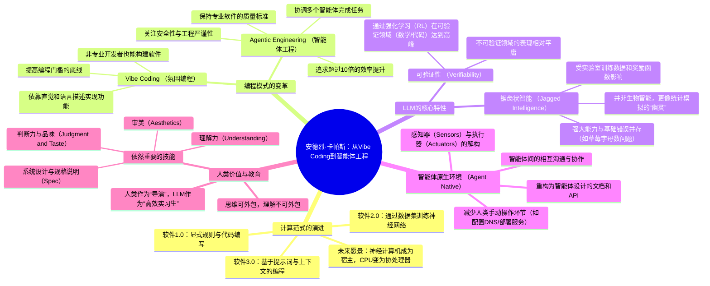

## 图谱（Obsidian 预览中打开）

```mermaid
mindmap
root((安德烈·卡帕斯：从Vibe Coding到智能体工程))
  计算范式的演进
    软件1.0：显式规则与代码编写
    软件2.0：通过数据集训练神经网络
    软件3.0：基于提示词与上下文的编程
    未来愿景：神经计算机成为宿主，CPU变为协处理器
  编程模式的变革
    Vibe Coding （氛围编程）
      提高编程门槛的底线
      依靠直觉和语言描述实现功能
      非专业开发者也能构建软件
    Agentic Engineering （智能体工程）
      保持专业软件的质量标准
      协调多个智能体完成任务
      追求超过10倍的效率提升
      关注安全性与工程严谨性
  LLM的核心特性
    可验证性 （Verifiability）
      通过强化学习（RL）在可验证领域（数学/代码）达到高峰
      不可验证领域的表现相对平庸
    锯齿状智能 （Jagged Intelligence）
      强大能力与基础错误并存（如草莓字母数问题）
      受实验室训练数据和奖励函数影响
      并非生物智能，更像统计模拟的“幽灵”
  智能体原生环境 （Agent Native）
    重构为智能体设计的文档和API
    减少人类手动操作环节（如配置DNS/部署服务）
    感知器（Sensors）与执行器（Actuators）的解构
    智能体间的相互沟通与协作
  人类价值与教育
    依然重要的技能
      审美（Aesthetics）
      判断力与品味（Judgment and Taste）
      理解力（Understanding）
      系统设计与规格说明（Spec）
    思维可外包，理解不可外包
    人类作为“导演”，LLM作为“高效实习生”
```

## 与 Wiki 的链接

<!-- Stage C 完成后自动补充 wikilinks -->
