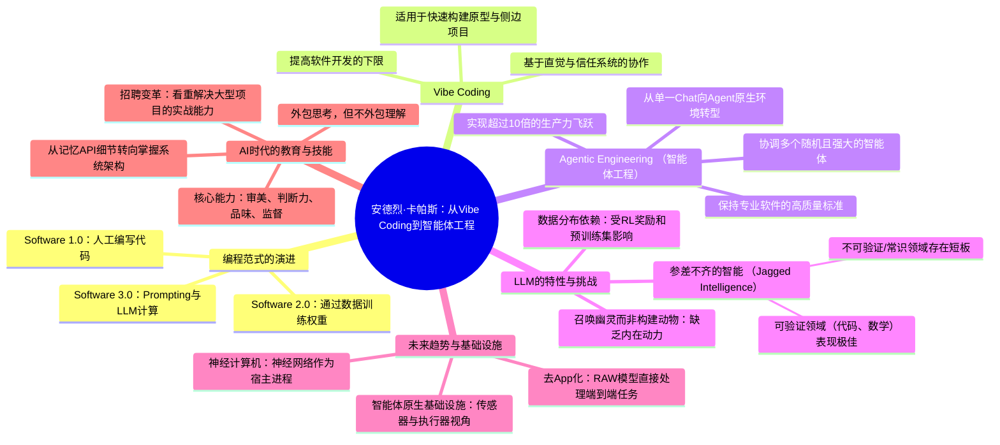

## 图谱（Obsidian 预览中打开）

```mermaid
mindmap
root((安德烈·卡帕斯：从Vibe Coding到智能体工程))
  编程范式的演进
    Software 1.0：人工编写代码
    Software 2.0：通过数据训练权重
    Software 3.0：Prompting与LLM计算
  Vibe Coding
    提高软件开发的下限
    基于直觉与信任系统的协作
    适用于快速构建原型与侧边项目
  Agentic Engineering （智能体工程）
    保持专业软件的高质量标准
    协调多个随机且强大的智能体
    实现超过10倍的生产力飞跃
    从单一Chat向Agent原生环境转型
  LLM的特性与挑战
    参差不齐的智能 （Jagged Intelligence）
      可验证领域（代码、数学）表现极佳
      不可验证/常识领域存在短板
    数据分布依赖：受RL奖励和预训练集影响
    召唤幽灵而非构建动物：缺乏内在动力
  未来趋势与基础设施
    神经计算机：神经网络作为宿主进程
    智能体原生基础设施：传感器与执行器视角
    去App化：RAW模型直接处理端到端任务
  AI时代的教育与技能
    外包思考，但不外包理解
    核心能力：审美、判断力、品味、监督
    从记忆API细节转向掌握系统架构
    招聘变革：看重解决大型项目的实战能力
```

## 与 Wiki 的链接

<!-- Stage C 完成后自动补充 wikilinks -->
