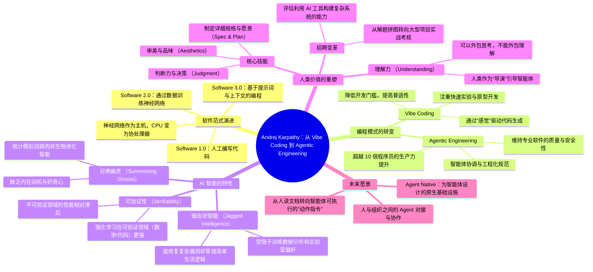

## 图谱（Obsidian 预览中打开）

```mermaid
mindmap
root((Andrej Karpathy：从 Vibe Coding 到 Agentic Engineering))
  软件范式演进
    Software 1.0：人工编写代码
    Software 2.0：通过数据训练神经网络
    Software 3.0：基于提示词与上下文的编程
    神经网络作为主机，CPU 变为协处理器
  编程模式的转变
    Vibe Coding
      通过“感觉”驱动代码生成
      降低开发门槛，提高普适性
      注重快速实验与原型开发
    Agentic Engineering
      维持专业软件的质量与安全性
      智能体协调与工程化规范
      超越 10 倍程序员的生产力提升
  AI 智能的特性
    可验证性 （Verifiability）
      强化学习在可验证领域（数学/代码）更强
      不可验证领域的性能相对滞后
    锯齿状智能 （Jagged Intelligence）
      能修复复杂漏洞却答错简单生活逻辑
      受限于训练数据分布和实验室偏好
    召唤幽灵 （Summoning Ghosts）
      统计模拟回路而非生物进化智能
      缺乏内在动机与好奇心
  人类价值的重塑
    核心技能
      审美与品味 （Aesthetics）
      判断力与决策 （Judgment）
      制定详细规格与愿景 （Spec & Plan）
    理解力 （Understanding）
      可以外包思考，不能外包理解
      人类作为“导演”引导智能体
    招聘变革
      从解题拼图转向大型项目实战考核
      评估利用 AI 工具构建复杂系统的能力
  未来愿景
    Agent Native：为智能体设计的原生基础设施
    从人读文档转向智能体可执行的“动作指令”
    人与组织之间的 Agent 对接与协作
```

## 与 Wiki 的链接

<!-- Stage C 完成后自动补充 wikilinks -->
